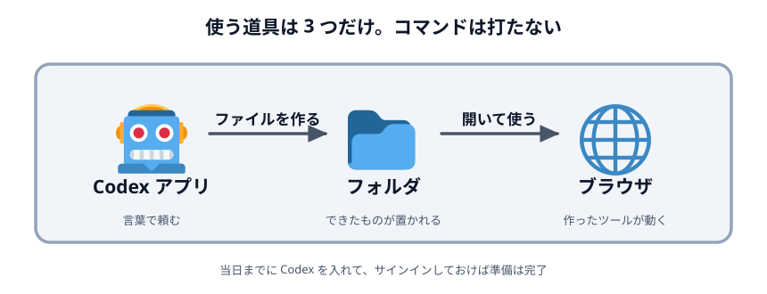
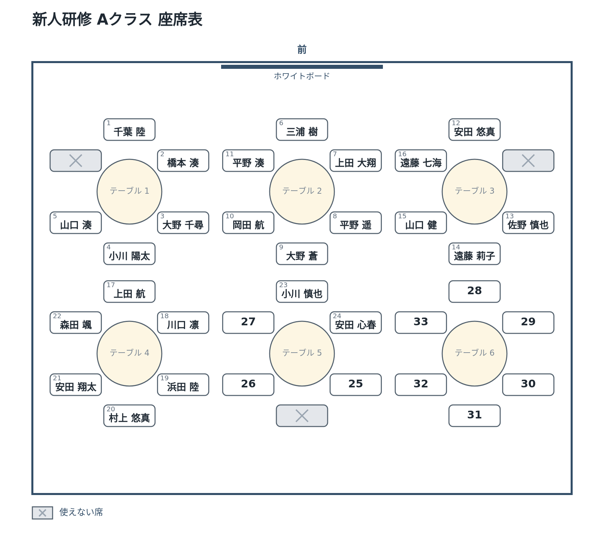
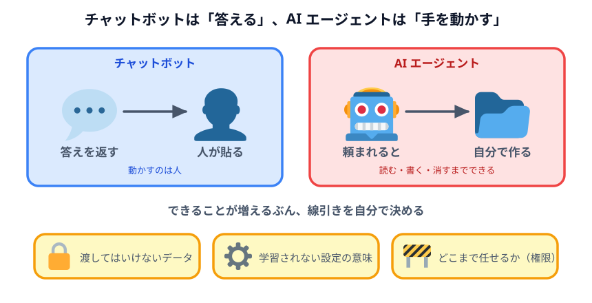
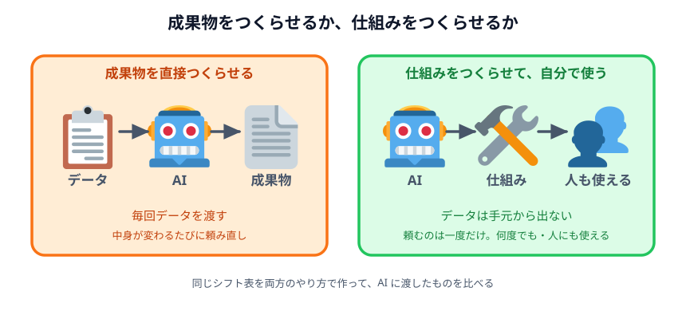
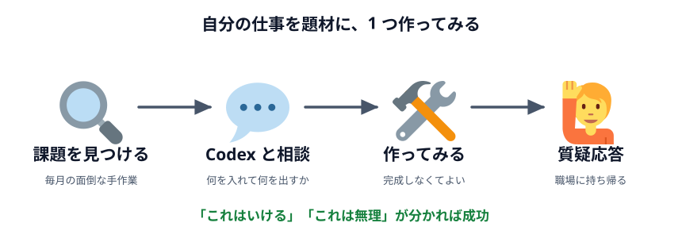

# AI エージェント業務活用ハンズオン

Codex を使って、**座席表**と**シフト表**を実際に作りながら進める半日のハンズオンです。

プログラミングの経験は要りません。コードを書くのは Codex で、私たちがやるのは「何がほしいかを
言葉で伝える」「出てきたものを確かめる」「どこまで任せるかを決める」の 3 つです。

## ハンズオンの流れ

半日（3〜4 時間）で、次の 5 つを順に進めます。手を動かす時間と、座って聞く時間が交互に来ます。

### 1. 環境構築

使うのは **Codex アプリ・フォルダ・ブラウザ** の 3 つだけです。Codex（OpenAI の AI エージェント）に
日本語で頼むとフォルダにファイルができ、それをブラウザで開いて使います。コマンドを打つ場面は
ありません。Codex のインストールとサインインは、当日までに各自で済ませておきます
（[環境構築](./sections/01-setup/)）。

### 2. 座席表を作る

最初の実習です。部屋の広さや丸テーブルの並べ方を**言葉で伝えるだけ**で、上のような座席表の画像ができる
ページを Codex に作ってもらいます。使えない席・番号・名前と 5 段階で育てていき、最後は名簿の
CSV を渡すだけで、クラスごとの座席表をまとめて保存できるようにします。ここで「頼む → 確かめる →
言い直す」という AI エージェントとの付き合い方を体で覚えます（[座席表を作る](./sections/02-seating-chart/)）。

### 3. AI エージェントとセキュリティ

ChatGPT のような**チャットボット**は答えを返すだけで、それを使うのは人です。**AI エージェント**は
頼まれると自分でファイルを作り、書き換え、消すこともできます。便利なぶん、何を渡してはいけないか、
「学習されない設定」で何が守られて何が守られないか、どこまで任せるか（権限）を、自分で決められる
ようにします（[セキュリティの話](./sections/03-security/)）。

### 4. データと仕組み

このハンズオンの芯になる考え方です。AI に**成果物を直接つくらせる**と、そのたびに社内データを渡す
ことになります。AI には**成果物をつくる仕組み（ツール）をつくらせ**、データを流し込むのは自分の PC
の中で行えば、データは外に出ません。できた仕組みは、自分だけでなく同僚にも使ってもらえます。
話を聞いたあと、シフト表を題材に両方のやり方を実際に試し、AI に渡したものの差を比べます
（[データと仕組み](./sections/04-data-and-logic/)・[シフト表を作る](./sections/05-shift-table/)）。

### 5. 業務への活用

最後は自分の仕事が題材です。毎月・毎週くり返している面倒な手作業から課題を 1 つ選び、Codex と
相談しながら小さなツールを作ってみます。時間内に完成させることは目指しません。「これは AI で
いける」「これは無理」の見極めがつけば成功です。最後に質疑応答で、職場に持ち帰るときの疑問を
解消します（[自分の業務に応用する](./sections/06-apply/)）。

## このハンズオンで持ち帰るもの

半日の終わりに、次の 3 つが手元に残ります。

1. **動くツールが 2 つ** — 座席表を画像で作るページと、シフト表を組む画面。どちらも自分の PC だけで動きます
2. **社内データの線引き** — どこまで Codex に渡してよく、どこから渡さずに済ませるかの判断
3. **自分の業務のネタ 1 つ** — 最後の時間で、自分の仕事から題材を 1 つ選んで小さく作ります

下の画面は、どれも当日 Codex に作ってもらうものの完成例です。実際に触ってみてください
（ボタンを押すと、画像の保存やシフトの組み直しができます）。

### 座席表を画像で作るページ

部屋の大きさとテーブルの並べ方を言葉で伝えると、その部屋の座席表が PNG 画像になります。
使えない席・番号・名前と段階的に足していき、最後は名簿の CSV を渡すだけで、
クラスごとの座席表を一気に保存できるところまで育てます（[座席表を作る](./sections/02-seating-chart/)）。

::preview[座席表の完成例（「まとめて PNG で保存」を押すと、3 クラス分の画像がダウンロードされます）]{src="02-seating-chart/05-csv" width="1100" height="520"}

### シフト表を組む画面

スタッフの出られる曜日と条件を書くと、1 週間のシフト表を組んでくれます。
入力した内容はこのページの中だけで処理され、外には一切送られません。

::preview[シフト表の完成例（通信は 0 件）]{src="05-shift-table/03-local-logic" width="1100" height="470"}

### 社内データの線引き

[シフト表を作る](./sections/05-shift-table/) では、上の画面を 3 通りのやり方で作ります。
やり方を変えるたびに Codex に渡す情報が減っていき、最後は**実データを 1 件も渡さずに**
同じものが手に入ります。この差を体験するのが、このハンズオンの芯です。

### 自分の業務のツール

最後は、自分の仕事から題材を 1 つ選んで作ります。「入力 → 処理 → 出力」の形だけが入った
ひな形から始めて、Codex と相談しながら自分の業務に合わせて育てます。

::preview[自分の業務ツールのひな形（ここを土台に書き換えていきます）]{src="06-apply/04-build" width="1100" height="440"}

## 進め方

各レクチャーのフォルダには、**その回の完成例**が入っています。まず自分で Codex に頼んでみて、
うまくいかなかったら完成例を見る、という順番で使ってください。完成例はサイト上でそのまま動かせます。

- **セクション** — テーマで束ねた親フォルダ（`sections/02-seating-chart/` など）
- **レクチャー** — 1 つのステップ（`sections/02-seating-chart/01-room/` など）

## 準備

当日までにやっておくことは [当日までの準備](./sections/README.md) にまとめてあります。
**Codex アプリのインストールと ChatGPT へのサインインだけは、当日までに済ませておいてください。**
ここで詰まると、それだけで 30 分溶けます。

## ドキュメントサイト

この教材は GitHub Pages でも読めます: <https://seekseep.github.io/ai-adoption-handson/>

## 注意事項

- 学習用のリポジトリです。教材内のデータはすべて架空のものです
- 実際の業務データを使うときは、[セキュリティの話](./sections/03-security/) を読んでからにしてください
