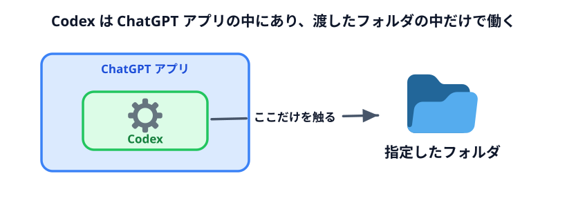
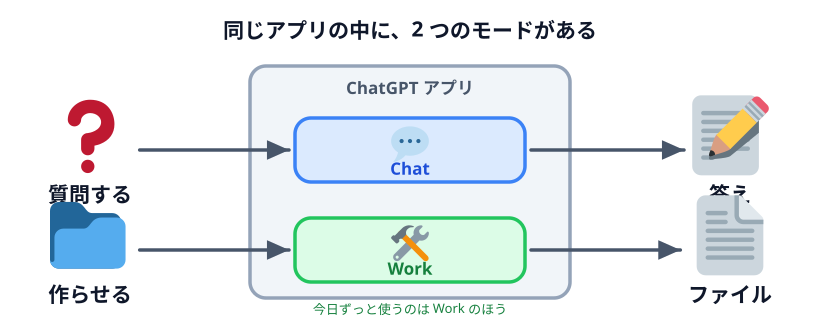
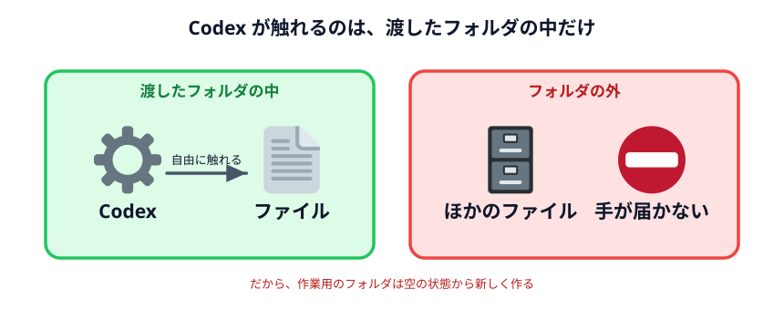

# Codex をインストールする



Codex を PC に入れて、「フォルダを指定して、日本語で頼んだらファイルができる」ところまでを確認します。
ここができれば今日の残りは全部できます。

:::notice[まずここだけ]
このハンズオンで必要なのは **Codex をインストールしてサインインし、作業フォルダを 1 つ指定する**
ことだけです。コマンドを打つ必要はありません。
:::

## Codex は ChatGPT アプリの中にある

「Codex」という名前だけを探すと見つからないことがあります。**Codex は ChatGPT デスクトップアプリの
機能として入っています。** 入れるのは ChatGPT アプリ、使うのはその中の Codex です。



アプリを開くと、入力欄の上あたりに **Chat** と **Work** の切り替えがあります。

- **Chat** — いつもの ChatGPT。質問して答えが返ってくる
- **Work** — Codex。フォルダを指定して、その中のファイルを実際に作ったり直したりする

今日ずっと使うのは **Work** 側です。

## インストールする

### Windows

Microsoft Store から ChatGPT デスクトップアプリを入れます。Store で「ChatGPT」を検索するか、
ブラウザから [ChatGPT desktop app for Windows](https://get.microsoft.com/installer/download/9PLM9XGG6VKS?cid=website_cta_psi)
を開いてください。

Windows 11 が推奨です。Windows 10 でも最新まで更新してあれば動きますが、うまくいかないことがあります。

:::notice[WSL は要りません]
「Codex を Windows で使うには WSL（Linux 環境）が必要」という古い情報が出回っていますが、
いまは不要です。Windows のまま動きます。
:::

### Mac

<https://openai.com/codex/> または <https://chatgpt.com/download> からダウンロードして、
アプリケーションフォルダに入れます。

:::warning[Intel の Mac を使っている場合]
公式サイトのトップにあるダウンロードは **Apple Silicon（M1 以降）専用**です。Intel の Mac だと
インストールできても起動時にエラーになります。

Intel 版も提供されていますが導線が分かりにくいので、Intel Mac の方は
**ブラウザ版（<https://chatgpt.com/codex>）で参加**するのが確実です。ブラウザ版は
自分の PC のフォルダは触れませんが、今日の内容は大半が追えます。
:::

## サインインする

アプリを起動して、ChatGPT アカウントでサインインします。

ここで **ChatGPT Plus 以上のプラン**が必要です。無料プランでも画面は開きますが、
数回やりとりすると上限に当たって止まります。

:::warning[会社のアカウントでサインインするとき]
Business / Enterprise プランでは、管理者が Codex の利用を制限していることがあります。
サインインできても Work が使えない場合は、プランの問題ではなく管理者設定です。
その場合は個人アカウントに切り替えるか、情報システム部門に相談してください。
:::

## 作業フォルダを指定する

ここが Codex の一番大事なところです。**Codex は「指定したフォルダの中」でしか作業しません。**

デスクトップに `handson` という名前の空フォルダを作り、それを指定します。

- **Windows** — アプリ内の **Add new project** を押すか、`Ctrl + O` でエクスプローラーが開きます
- **Mac** — 同じく「フォルダを開く」から選びます

指定すると、画面のどこかにフォルダ名が出ます。**これが「いま Codex が触れる範囲」です。**
ここに無いファイルは、勝手には読まれません。



この「範囲」の考え方は、[AI エージェントに与える権限](../../03-security/04-permissions/LECTURE.md)
でもう一度詳しく扱います。今は「フォルダを 1 つ決めて渡した」とだけ覚えておいてください。

## 動くかどうか試す

入力欄が **Work** になっていることを確認して、次の文をそのまま貼って送ってください。

```text
このフォルダに hello.html というファイルを作ってください。
開いたら「うごきました」と大きく表示されるだけの、すごく簡単なページでいいです。
```

Codex が「こういうファイルを作ります」と提案してきます。**承認**して進めてください。

### 確認ポイント

- `handson` フォルダの中に `hello.html` ができている
- それをダブルクリックすると、ブラウザに「うごきました」と表示される
- ブラウザのアドレスバーが `file:///` で始まっている（インターネット上のページではなく、
  自分の PC のファイルを開いている印）

この 3 つが確認できたら環境構築は完了です。

## うまくいかないとき

| 症状 | 見るところ |
|---|---|
| サインインできない | プランが無料になっていないか。会社アカウントで管理者に止められていないか |
| Work が選べない | 会社アカウントの管理者設定。個人アカウントで試す |
| フォルダを選べない | フォルダが存在しているか。クラウド同期フォルダ（OneDrive など）は避ける |
| ファイルができない | 承認待ちで止まっていないか。提案を承認したか |
| Mac で起動しない | Intel Mac の可能性。ブラウザ版に切り替える |

:::notice[画面の名前が違っていたら]
Codex と ChatGPT アプリは更新が速く、ボタンの名前や場所がこの教材と変わっていることがあります。
「フォルダを指定するところ」「入力欄」「入力欄の下の権限メニュー」の 3 か所を探してください。
名前が変わっていても、その 3 つは必ずあります。
:::

## 次へ

環境構築の残り 2 つ（[Python](../02-python/LECTURE.md) /
[Node.js](../03-nodejs/LECTURE.md)）は参考ページなので飛ばしてかまいません。

そのまま [部屋とテーブルを描く](../../02-seating-chart/01-room/LECTURE.md) に進んでください。
