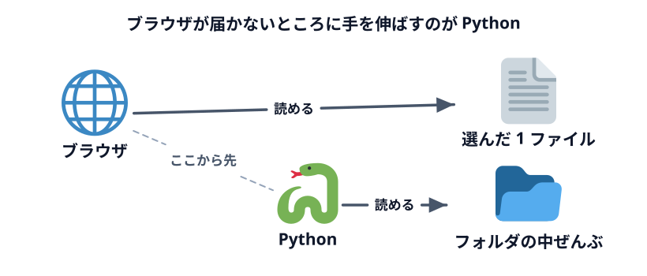
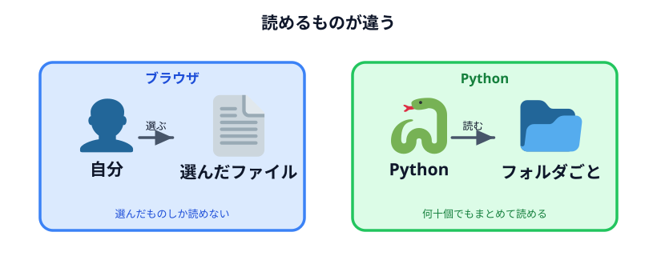

# Python をインストールする（参考）



:::notice[今日は使いません]
このページは参考です。今日作るツールはすべてブラウザだけで動くので、Python を入れなくても
最後まで進めます。休憩時間や後日のために置いてあります。
:::

## なぜ Python の話が出てくるのか

今日作るツールは「データを画面に貼り付けて、ボタンを押すと結果が出る」形です。この形なら
ブラウザだけで完結します。

ただ、実務でやりたくなるのはたいてい次の形です。

> フォルダの中にある Excel や CSV を**全部まとめて**読んで、1 枚の表にする

これはブラウザではできません。**ブラウザには「勝手に PC のフォルダを読んではいけない」という
安全のための制限がある**からです。ユーザーがファイルを選んで渡したものしか読めません。



この制限を超えたいときに使うのが Python です。Python はフォルダの中を自由に読んで、
何十個のファイルでもまとめて処理できます。

**つまり Python は「ブラウザでは届かないところに手を伸ばす道具」です。** 逆に言えば、
ブラウザで足りるなら入れなくていい。今日はそちら側の作り方を選んでいます。

## インストールする

### Windows

Microsoft Store で「Python」を検索して、いちばん新しいバージョンを入れるのが一番簡単です。

<https://www.python.org/downloads/> のインストーラーを使う場合は、最初の画面で
**「Add python.exe to PATH」にチェックを入れてください。** ここを忘れると、あとで
「Python が見つからない」と言われます。

### Mac

<https://www.python.org/downloads/> からインストーラーをダウンロードして実行します。

Mac には最初から古い Python が入っていることがありますが、それとは別に入れて問題ありません。

## 入ったか確認する

Codex に次のように頼めば、確認までやってくれます。

```text
この PC に Python が入っているか確認して、入っているならバージョンを教えてください。
```

自分で確認したい場合は、ターミナル（Mac）または PowerShell（Windows）で次を実行します。

```sh
# Windows
py --version

# Mac
python3 --version
```

`Python 3.` から始まる文字が出れば入っています。

## Python で何ができるようになるか

Codex に頼むときの言い方の例です。今日の内容の続きとして読んでください。

```text
このフォルダの中にある売上_*.csv をすべて読み込んで、
月ごとの合計を1枚の CSV にまとめる Python のスクリプトを作ってください。
実行はまだしなくていいので、まずスクリプトだけ作ってください。
```

重要なのは最後の一文です。**スクリプトだけ作ってもらい、実行は自分でする。** こうすると
CSV の中身は Codex に渡らず、自分の PC の中だけで処理が終わります。

この「仕組みだけもらう」という考え方は、
[仕組みからデータを作る](../../04-data-and-logic/02-logic-to-data/LECTURE.md) で詳しく扱います。

:::warning
Python のスクリプトは、ブラウザのページと違ってフォルダの中を自由に触れます。
つまり**書き換えや削除もできます。** Codex に実行までさせるときは、何をするスクリプトなのかを
確認してからにしてください。判断のしかたは
[AI エージェントに与える権限](../../03-security/04-permissions/LECTURE.md) にあります。
:::
