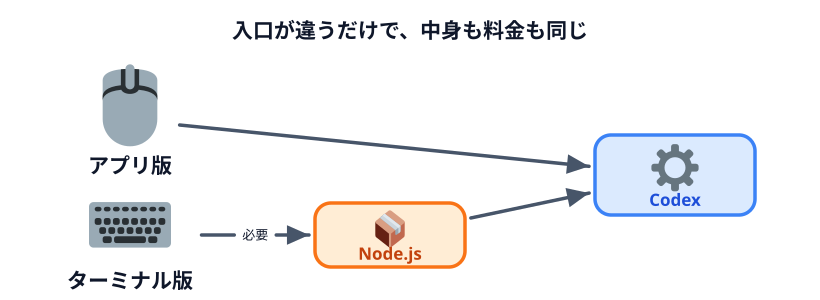
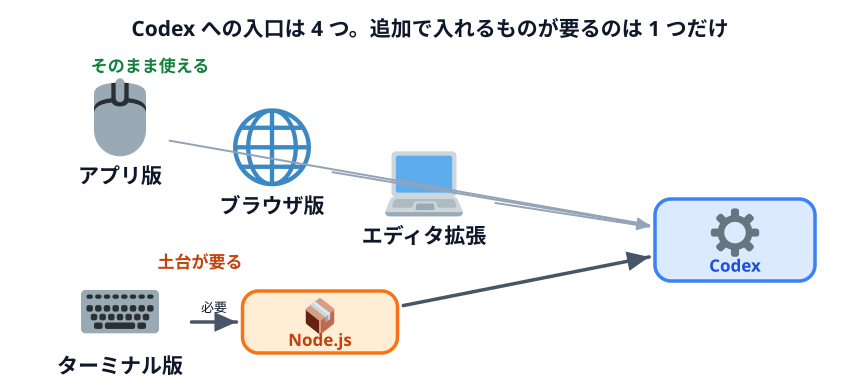

# Node.js をインストールする（参考）



:::notice[今日は使いません]
このページは参考です。今日はアプリ版の Codex だけを使います。
:::

## なぜ Node.js の話が出てくるのか

Codex には使い方が何通りかあります。

| 使い方 | 見た目 | 追加で必要なもの |
|---|---|---|
| **アプリ版**（今日使う） | チャット画面 | なし |
| **ブラウザ版** | チャット画面 | なし |
| **ターミナル版（Codex CLI）** | 黒い画面にコマンド | **Node.js** |
| **エディタ拡張** | VS Code の中 | なし（VS Code が必要） |

このうち**ターミナル版だけが Node.js を必要とします。** Node.js は「JavaScript で書かれた
プログラムを PC 上で動かすための土台」で、Codex CLI 自身がその上で動いているためです。



中身は同じ Codex で、料金も同じ ChatGPT のプランです。**追加料金はかかりません。**
違うのは操作の見た目だけです。

## どっちを使えばいいのか

非エンジニアの方は**アプリ版のままで問題ありません。** ターミナル版が向いているのは次のような場合です。

- 同じ作業を毎日自動で回したい（定時実行など）
- 開発の作業と地続きで使いたい
- 画面を使わずに、他のツールと組み合わせて動かしたい

「いつか自動化したくなったら思い出す」くらいで十分です。

## インストールする

### Windows

<https://nodejs.org/> を開いて、**LTS** と書かれている方をダウンロードして実行します。
LTS は「長期サポート版」で、安定して動くバージョンです。

コマンドで入れる場合は PowerShell で次を実行します。

```powershell
winget install OpenJS.NodeJS.LTS
```

### Mac

同じく <https://nodejs.org/> から **LTS** 版のインストーラーをダウンロードして実行します。

## 入ったか確認する

ターミナル（Mac）または PowerShell（Windows）で次を実行します。

```sh
node --version
```

`v` で始まる数字が出れば入っています。

## Codex CLI を入れる

Node.js が入っていれば、次の 1 行で Codex CLI が入ります。

```sh
npm install -g @openai/codex
```

入ったら、作業したいフォルダに移動して `codex` と打つと起動します。

```sh
codex
```

アプリ版と同じ ChatGPT アカウントでサインインして使います。

:::notice[権限の考え方は同じ]
ターミナル版でも「どこまで任せるか」を選びます。アプリ版の権限メニューにあたるものが、
CLI では `/permissions` というコマンドです。

考え方はまったく同じなので、[AI エージェントに与える権限](../../03-security/04-permissions/LECTURE.md)
を読んでおけばどちらでも通用します。
:::
