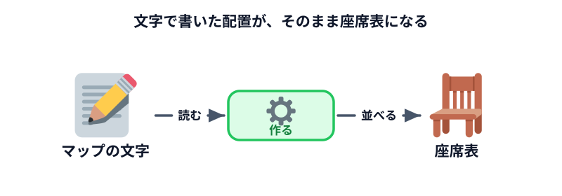

# 座席の配置図を作る



最初の実習です。**机の配置を文字で書くと、そのとおりに座席表が描かれる画面**を作ります。

まだ人は座りません。まず「箱を並べる」ところからです。

## 何を作るのか

左側に部屋のマップを文字で書く欄があり、右側にその通りの座席表が出る画面です。

マップはこう書きます。

```text
A1 A2 . B1 B2
A3 A4 . B3 B4
A5 A6 . B5 B6
```

1 行が横 1 列。空白で区切った 1 つが 1 席。`.` は通路です。

**なぜ文字で書くのか。** 席の配置は職場ごとに違うし、部署が変わるたびに変わります。
コードの中に配置を埋め込むと、変えるたびに Codex に頼み直すことになります。
画面から書き換えられるようにしておけば、自分で直せます。

## Codex に頼む

作業フォルダを指定した状態で、次の文をそのままコピーして Codex に送ってください。

```text
座席表を作るための、ブラウザだけで動くページを作ってください。

・index.html をダブルクリックすればそのまま動くようにしてください
・インターネットへの通信は一切しないでください
・画面の左に「座席のマップ」を書く大きなテキスト入力欄を置いてください
・マップは「1行が横1列、空白区切りで1席、ピリオドは通路」という書き方にしてください
・「座席表を作る」ボタンを押すと、画面の右にそのとおりの座席表が四角い箱で並ぶようにしてください
・最初から例のマップが入っていて、開いた時点で座席表が見えている状態にしてください

私はプログラミングが分からないので、ファイルは index.html と main.js と style.css の
3つだけにして、それぞれ何をするファイルなのかを短く説明してください。
```

Codex が「こういうファイルを作ります」と出してきたら、内容をざっと見て**承認**します。

## 動かして確かめる

できた `index.html` をダブルクリックしてブラウザで開きます。

### 確認ポイント

- 座席の箱が並んで表示されている
- マップの文字を書き換えてボタンを押すと、並びが変わる
- `.` を書いたところが通路になっていて、席と席の間が空いている
- アドレスバーが `file:///` で始まっている

見た目の色や大きさは完成例と違っていて構いません。**この 4 つが満たせていれば成功です。**

## うまくいかないときの言い方

Codex に直してもらうときは、「動かない」ではなく**何がどうなってほしいか**を伝えます。

| 起きたこと | 言い方 |
|---|---|
| 何も表示されない | 「開いても何も表示されません。最初からサンプルのマップが入っていて、開いた時点で座席表が見えるようにしてください」 |
| 通路が席として表示される | 「ピリオドの場所が席として表示されてしまいます。ピリオドは席ではなく通路として空けてください」 |
| 席がぜんぶ縦に並ぶ | 「1 行に書いた席が縦に並んでしまいます。同じ行の席は横一列に並べてください」 |
| ファイルが 1 つにまとまった | 「index.html と main.js と style.css の 3 つに分けてください」 |

:::notice[直すときは、元に戻す必要はありません]
Codex は前のやりとりを覚えています。「さっきのを、こう変えて」と続ければ直してくれます。
毎回ゼロから頼み直す必要はありません。
:::

## 動かして確認する

ここまでで作ったものと同じ画面です。実際に触って、マップを書き換えてみてください。

::preview[マップの文字を書き換えて「座席表を作る」を押すと、並びが変わります]

::codeview{defaultFile="main.js"}

## 次へ

次は [固定席・使用しない席を入れる](../02-fixed-seats/LECTURE.md) です。
「動かせない席がある」という現実の条件を足していきます。
