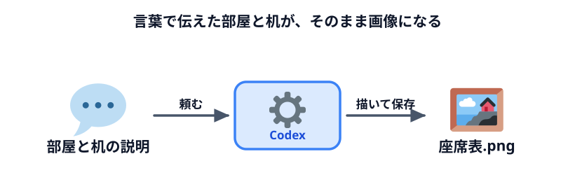
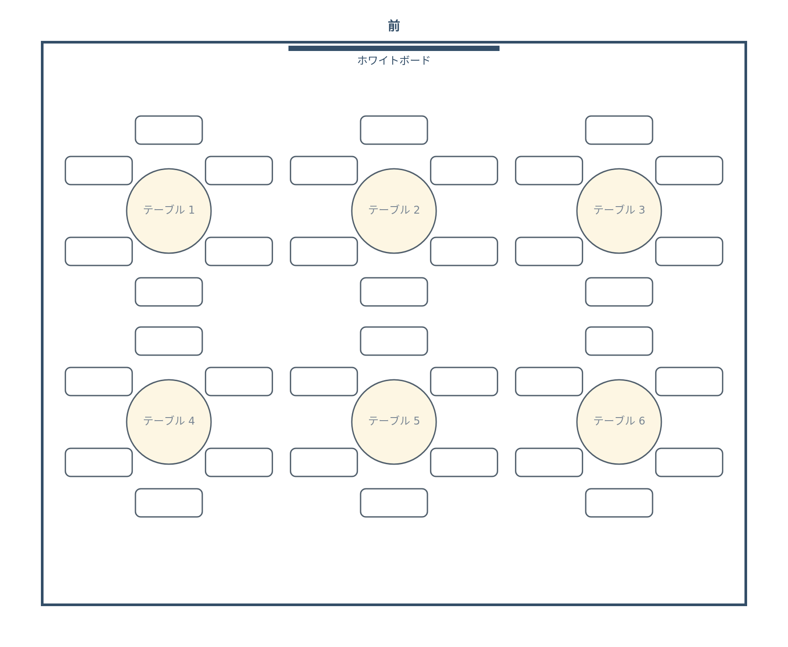
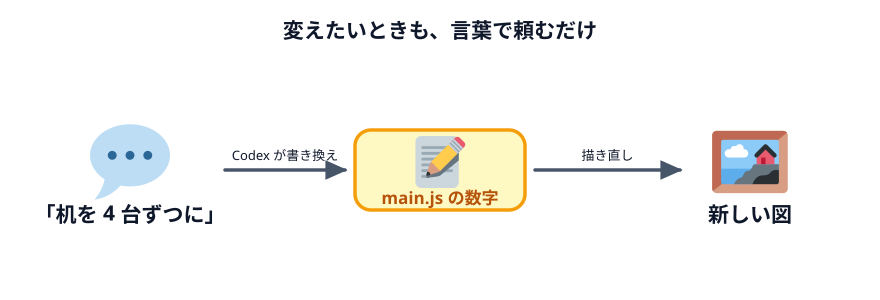

# 部屋とテーブルを描く



最初の実習です。**部屋の大きさとテーブルの並べ方を言葉で伝えると、その部屋を上から見た図が描かれ、
PNG 画像として保存できるページ**を作ります。

まだ人は座りません。まず「部屋に丸テーブルと椅子を並べる」ところからです。

## 何を作るのか

開くと会議室を上から見た図が出ていて、「PNG で保存」ボタンを押すと画像ファイルになるページです。
画像にしておけば、メールに貼る・印刷して入口に掲示する・資料に載せる、がそのままできます。

入力欄はありません。**部屋やテーブルの設定は、Codex に言葉で伝えます。** Codex はそれをプログラムの中に
書き込みます。変えたいときも、また言葉で頼みます。

## Codex に頼む

作業フォルダを指定した状態で、次の文をそのままコピーして Codex に送ってください。

:::prompt{project="座席表"}
```text
会議室の座席表を画像で作るための、ブラウザだけで動くページを作ってください。

部屋とテーブルは次のとおりです。
・部屋は 横 10m × 奥行き 8m。前（図の上側）の壁の真ん中にホワイトボードがある
・テーブルは 直径 1.2m の丸テーブル。まわりに椅子を 6 脚、等間隔に置く
・テーブルは横に 3 卓、前から 2 列の、全部で 6 卓。テーブルの中心どうしの間隔は 横 3.2m・縦 3m
・前の壁から 1 列目のテーブルの中心までは 2.4m あける

作ってほしいもの
・部屋を上から見た図を描いてください。椅子は、あとで番号や名前を書き込めるよう横長の札の形にしてください
・テーブルの真ん中に「テーブル 1」のように番号を書いてください。前の列の左から 1, 2, 3… です
・図の外の上に「前」と書いてください
・「PNG で保存」ボタンを押すと、図が PNG 画像としてダウンロードされるようにしてください
・index.html をダブルクリックすればそのまま動くようにしてください
・インターネットへの通信は一切しないでください

私はプログラミングが分からないので、ファイルは index.html と main.js と style.css の
3 つだけにしてください。部屋の大きさやテーブルの並べ方は、main.js の先頭にまとめて、
あとから私が読んでも分かるように日本語のコメントを付けてください。
```
:::

Codex が「こういうファイルを作ります」と出してきたら、内容をざっと見て**承認**します。

## 動かして確かめる

できた `index.html` をダブルクリックしてブラウザで開きます。

### できあがりの見本

「PNG で保存」で保存した画像が、次のようになれば OK です。
色や線の太さ・文字の大きさは違っていて構いません。下の確認ポイントを満たしているかで判断してください。



### 確認ポイント

- 部屋の枠の中に、丸テーブルが横 3 卓 × 2 列（全部で 6 卓）並んでいる
- どのテーブルのまわりにも椅子が 6 脚ずつ（全部で 36 脚）あり、前の壁にホワイトボードがある
- 「PNG で保存」を押すとファイルがダウンロードされ、開くと画面と同じ図が見える
- アドレスバーが `file:///` で始まっている

色や線の太さは完成例と違っていて構いません。**この 4 つが満たせていれば成功です。**

## 言葉で変えてみる



ここがこの節でいちばん体験してほしいところです。部屋やテーブルを**言葉で**変えてみます。
1 つずつ Codex に送って、そのたびにブラウザを再読み込みしてください。

:::prompt{project="座席表"}
```text
テーブルを横に 4 卓ずつにしてください。部屋の横幅は 13m に広げてください。
```
:::

:::prompt{project="座席表"}
```text
テーブルの列を 1 つ増やして、前から 3 列にしてください。部屋の奥行きは 11m に広げてください。
```
:::

変わったら、Codex に「**main.js のどこを変えましたか？**」と聞いてみてください。
先頭にまとめた数字のうち、どれが書き換わったかを教えてくれます。
あなたが言葉で伝えたことが、プログラムの中の数字になっている——それがこの節のポイントです。

試し終わったら、次の節に進む前に元に戻しておきます。

:::prompt{project="座席表"}
```text
テーブルは横 3 卓・前から 2 列、部屋は 横 10m × 奥行き 8m に戻してください。
```
:::

## うまくいかないときの言い方

Codex に直してもらうときは、「動かない」ではなく**何がどうなってほしいか**を伝えます。

| 起きたこと | 言い方 |
|---|---|
| 何も表示されない | 「開いても図が出ません。開いた時点で部屋の図が見えるようにしてください」 |
| テーブルが部屋からはみ出す | 「テーブルが部屋の枠からはみ出しています。左右と奥に余白が残るように並べ直してください」 |
| 椅子がテーブルに重なる | 「椅子がテーブルに重なっています。椅子をテーブルのまわりに、少し離して並べてください」 |
| 保存した画像の背景が黒い | 「保存した PNG の背景が黒く見えます。背景を白で塗ってから保存してください」 |
| 保存した画像がぼやける | 「保存した PNG が粗いです。印刷しても読めるよう、2 倍の細かさで保存してください」 |
| ファイルが 1 つにまとまった | 「index.html と main.js と style.css の 3 つに分けてください」 |

:::notice[直すときは、元に戻す必要はありません]
Codex は前のやりとりを覚えています。「さっきのを、こう変えて」と続ければ直してくれます。
毎回ゼロから頼み直す必要はありません。
:::

## うまくいかないときは

完成例のファイル一式をダウンロードできます。解凍して `index.html` をダブルクリックすると、
見本と同じ画像を保存できるページが開きます。

:::download
[完成例をダウンロード](./project.zip)
:::

## 次へ

次は [使えない席を指定する](../02-unavailable/LECTURE.md) です。
「この席は使えない」という現実の事情を、言葉で足していきます。
