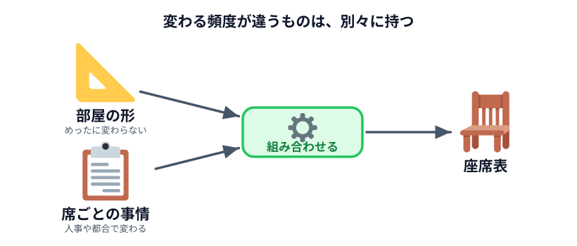
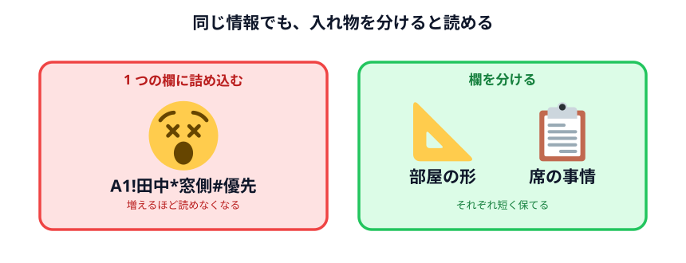

# 固定席・使用しない席などの情報を入れる



前の節で机が並びました。でも実際の職場には「動かせない席」があります。

- 部長の席は毎回そこ（**固定席**）
- そこは壊れている / 物置になっている（**使用しない席**）

これを画面に反映します。

## 欄をもう 1 つ増やす

ここで判断が必要です。この情報をどこに書くか。

**マップの中に書き込む**方法もあります。たとえば `A1!田中` のように。でもこうすると、
条件が増えるたびにマップが読めなくなります。`A1!田中*窓側#優先` のような文字列を
人間が読み書きするのは無理です。



なので**欄を分けます。**

- **座席のマップ** — どこに机があるか（部屋の形。めったに変わらない）
- **席の情報** — その席をどう扱うか（人事や都合で変わる）

変わる頻度が違うものは、分けておくと後が楽です。これは座席表に限らず、
データを扱うときの一般的なコツです。

## Codex に頼む

前の節の続きとして、次を送ってください。

```text
さっきの座席表に、席ごとの情報を入れられるようにしてください。

・マップの欄とは別に、「席の情報」を書くテキスト入力欄を増やしてください
・書き方は1行に1件で、次の2種類にしてください
  「席の名前 固定 名前」   … その人の固定席
  「席の名前 使用しない」   … 座れない席
・固定席は色を変えて、席の名前と一緒にその人の名前を表示してください
・使用しない席は、座れないと一目で分かる見た目にしてください
・どの色が何を意味するかの凡例を、座席表の下に出してください
・最初からサンプルの情報が入っている状態にしてください
```

## 動かして確かめる

### 確認ポイント

- 固定席に人の名前が表示され、他の席と色が違う
- 使用しない席が、座れないと分かる見た目になっている
- 凡例を見れば、どの色が何なのか分かる
- 「席の情報」の欄に 1 行足してボタンを押すと、その席の見た目が変わる

最後の 1 つが大事です。**自分で書き換えて反映されるか**を必ず試してください。
ここが動かないと、実際の業務では使えません。

## よくある詰まり

| 起きたこと | 言い方 |
|---|---|
| 席の情報を書いても反映されない | 「席の情報を書き換えてボタンを押しても座席表が変わりません。ボタンを押すたびに席の情報を読み直してください」 |
| 書き間違えると画面が真っ白 | 「席の情報に知らない書き方の行があっても、そこだけ無視して残りは表示してください」 |
| 固定席の名前が入りきらない | 「席の箱の中で、席の名前を小さく上に、人の名前を大きく下に並べてください」 |

2 つめは地味ですが実務では重要です。**入力を間違えた人が画面を壊さない**ようにしておくと、
自分以外の人にも渡せるツールになります。

## 動かして確認する

::preview[「席の情報」の欄に行を足して「座席表を作る」を押すと、色が変わります]

::codeview{defaultFile="main.js"}

## 次へ

次は [出席情報を反映する](../03-attendance/LECTURE.md) です。
今日いる人だけを席に座らせます。
