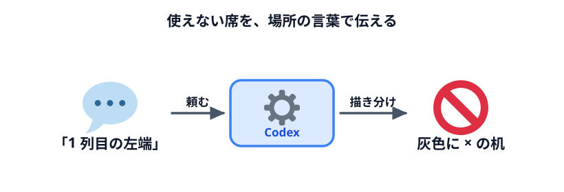
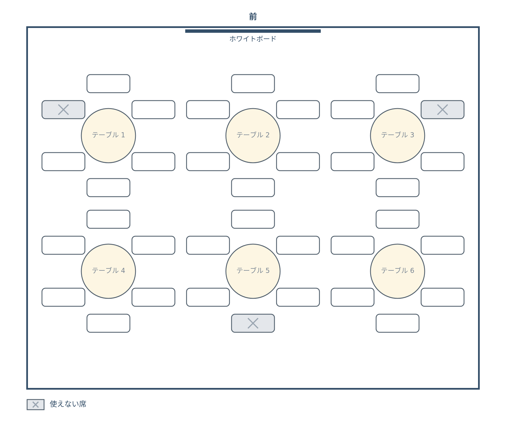
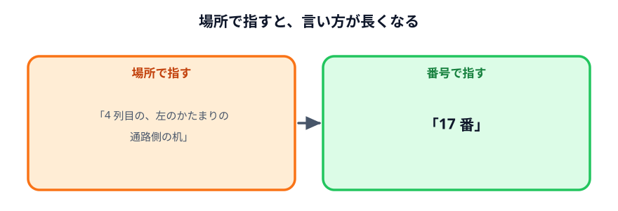

# 使えない席を指定する



前の節で描いた部屋に、**使えない席**を足します。

出入口の前、柱のそば、壊れている椅子。実際の部屋には、椅子はあっても人を座らせたくない場所があります。
座席表を配ってから「そこ、座れないんですけど」と言われないように、図の上で先に塞いでおきます。

## Codex に頼む

前の節の続きで、同じ Codex のやりとりに次の文を送ってください。

:::prompt{project="座席表"}
```text
さっきの座席表に、使えない席を描き分けられるようにしてください。

使えない席は次の 3 つです。
・テーブル 1 の、左前の椅子（出入口の前）
・テーブル 3 の、右前の椅子（出入口の前）
・テーブル 5 の、いちばん後ろ側の椅子（柱がある）

・使えない席は、椅子を灰色に塗って × を付けてください
・図の下に「灰色に × は使えない席」という凡例を出してください
・使えない席は、main.js の先頭に一覧でまとめて、どの椅子なのかコメントを付けてください
```
:::

## 動かして確かめる

ブラウザを再読み込みします。

### できあがりの見本

「PNG で保存」で保存した画像が、次のようになれば OK です。
色や線の太さ・文字の大きさは違っていて構いません。下の確認ポイントを満たしているかで判断してください。



### 確認ポイント

- テーブル 1 の左前、テーブル 3 の右前、テーブル 5 のいちばん後ろの椅子が灰色で × が付いている
- ほかの 33 脚は白いまま
- 図の下に凡例が出ている
- 「PNG で保存」で保存した画像にも、灰色の椅子と凡例が入っている

## 言葉で変えてみる

使えない席も、言葉で足したり減らしたりできます。

:::prompt{project="座席表"}
```text
テーブル 6 の、右後ろの椅子も使えないことにしてください。
```
:::

:::prompt{project="座席表"}
```text
さっき足したテーブル 6 の椅子は、やっぱり使えることにしてください。
```
:::

## 場所を言葉で指すのは、けっこう大変



やってみて気づいたと思います。「テーブル 5 の、いちばん後ろ側の椅子」は、**言うのも聞くのも長い**。
時計回りに数えるのか、どこが「前」なのか。Codex が読み違えて、別の椅子を塞いでしまうこともあります。

人に伝えるときも同じです。「テーブル 4 の、いちばん前側の椅子に座ってください」より、
「17 番に座ってください」のほうがずっと楽です。

そこで次の節では、席に**番号**を振ります。

## うまくいかないときの言い方

| 起きたこと | 言い方 |
|---|---|
| 違う椅子が灰色になった | 「灰色になった椅子が違います。テーブル 5 の椅子のうち、ホワイトボードからいちばん遠い椅子です」 |
| 凡例が出ない | 「図の下に凡例がありません。保存した画像にも凡例が入るように、図の中に描いてください」 |
| 凡例が画面にだけ出る | 「凡例が画面には出ますが、保存した PNG に入っていません。図の一部として描いてください」 |

## うまくいかないときは

完成例のファイル一式をダウンロードできます。解凍して `index.html` をダブルクリックすると、
見本と同じ画像を保存できるページが開きます。

:::download
[完成例をダウンロード](./project.zip)
:::

## 次へ

次は [席に番号を振る](../03-numbering/LECTURE.md) です。
