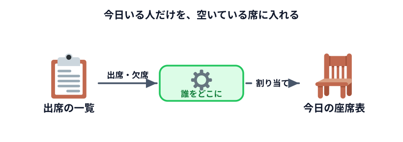
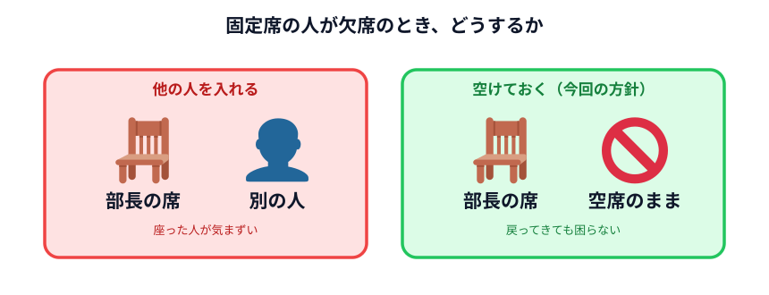

# 出席情報を反映する



ここから画面が**判断**を始めます。今までは書いたとおりに表示していただけですが、
ここからは「誰をどこに座らせるか」をアプリが決めます。

## 決めないといけないこと

出席情報を足すと、考えることが増えます。

- 出席している人を、空いている席に入れる
- 固定席の人は、その席に座る
- **固定席の人が欠席だったら、その席はどうするのか**

3 つめが厄介です。空いたから他の人を入れる？　それとも空けておく？

職場によって違いますが、今回は**空けておく**ことにします。部長の席に別の人が座っていたら
気まずいからです。



:::notice[こういう抜けの見つけ方]
「固定席の人が欠席したら」は、言われるまで気づきにくい条件です。こういう抜けは、
**実際のデータを入れて動かしてみたときに初めて見つかります。**

だから「まず動くものを作って、動かして気づく」順番が効きます。最初から完璧な仕様を
考えようとしないでください。
:::

## Codex に頼む

```text
さっきの座席表に、出席情報を反映できるようにしてください。

・「出席」を書くテキスト入力欄を増やしてください
・書き方は1行に1人で「名前 出席」または「名前 欠席」にしてください
・出席している人を、空いている席に上から順番に割り当ててください
・固定席の人はその席に座らせてください
・固定席の人が欠席の場合は、その席は空けたままにして、他の人を入れないでください
・割り当てた席は、固定席とは別の色にしてください
・座席表の下に「出席○人 / 欠席○人」と出してください
・出席者の数が席の数より多くて座れない人がいたら、その人の名前を出してください
```

## 動かして確かめる

### 確認ポイント

- 出席の人が席に入り、欠席の人はどこにも出てこない
- 固定席の人が欠席のとき、その席が空いている（他の人が入っていない）
- 「出席○人 / 欠席○人」が合っている
- 出席欄の「欠席」を「出席」に書き換えると、その人が席に現れる

### 席が足りないときを試す

出席欄に人を足していって、**席の数より多くしてください。**

座れない人の名前が出ましたか。出たなら正解です。

**これは不具合ではなく、業務上の問題です。** 「エラーで止まる」のではなく
「誰が座れないのかを教える」のが正しい振る舞いです。ツールを作るときは、
この違いを意識すると使えるものになります。

## よくある詰まり

| 起きたこと | 言い方 |
|---|---|
| 欠席の人も席に入っている | 「欠席と書いた人は席に割り当てないでください」 |
| 固定席の人が二重に出る | 「固定席の人は、その固定席にだけ表示してください。空き席には割り当てないでください」 |
| 席が足りないと画面が止まる | 「席が足りない場合もエラーにせず、座れなかった人の名前を画面に出してください」 |
| 押すたびに並びが変わる | 「出席の順番どおりに上から割り当ててください。押すたびに変わらないようにしてください」 |

## 動かして確認する

::preview[出席欄の「出席」と「欠席」を書き換えて、座席表がどう変わるか見てください]

::codeview{defaultFile="main.js"}

## 次へ

次は [条件を伝えながら修正する](../04-refine/LECTURE.md) です。
「あの 2 人は離してほしい」という、いちばん面倒な要求に対応します。
