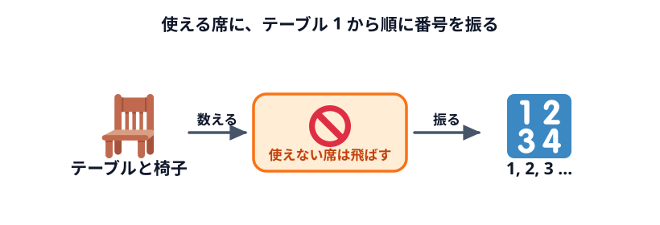
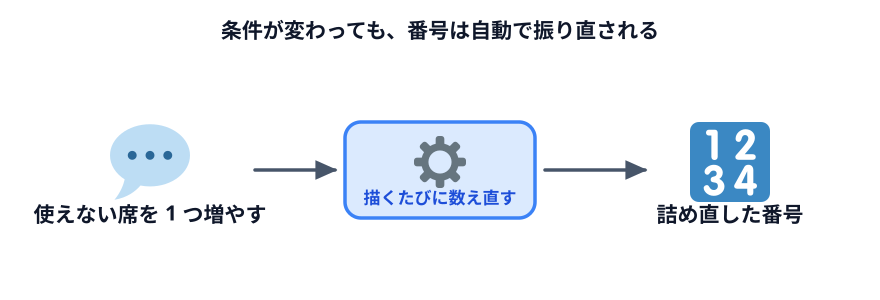

# 席に番号を振る



使える席に**番号**を振ります。これで「17 番の席」と 1 語で指せるようになります。

## 番号の振り方を決める

番号は、振り方のルールを先に決めておくのが大事です。ここでは次のルールにします。

- **前の列から**、同じ列の中は**左から**順に 1, 2, 3…
- **使えない席は飛ばす**（番号を付けない）

「1 番は前の左端」と決まっていれば、図を見なくても大体の場所が分かります。

## Codex に頼む

```text
さっきの座席表で、使える席に番号を振ってください。

・前の列から順に、同じ列の中は左から右へ 1, 2, 3… と振ってください
・通路をまたいでも、同じ列の中では左から続けて数えてください
・使えない席は飛ばして、番号を付けないでください
・番号は机の真ん中に、大きめの文字で書いてください
・番号は決め打ちで書かずに、描くたびに上のルールで数えるようにしてください
```

最後の 1 行が大事です。**「決め打ちで書かずに、描くたびに数える」**。
これを言っておかないと、Codex が 1〜27 を 1 つずつ机に書き込むことがあります。
そうすると、使えない席を変えたときに番号がずれたままになります。

## 動かして確かめる

### 確認ポイント

- 1 列目は、左端が使えない席なので、その右の机が 1 番になっている
- 番号が前の列から、左から順に続いている（1 列目の最後が 4 番、2 列目の左端が 5 番）
- 灰色の机には番号が付いていない
- いちばん後ろの右端が 27 番になっている

## 言葉で変えてみる



ルールで番号を振っているので、条件を変えても**番号は自動で振り直されます**。確かめてみましょう。

```text
前から 2 列目の、いちばん左の机も使えないことにしてください。
```

2 列目の左端が灰色になり、そこから後ろの番号が 1 つずつ詰まって、最後が 26 番になれば成功です。
確かめたら元に戻します。

```text
2 列目のいちばん左の机は、使えることに戻してください。
```

番号の振り方そのものを変えることもできます。

```text
番号を、後ろの列から振るように変えてください。
```

## うまくいかないときの言い方

| 起きたこと | 言い方 |
|---|---|
| 使えない席にも番号がある | 「灰色の机にも番号が付いています。使えない席は飛ばして数えてください」 |
| 左右のかたまりで別々に数えている | 「左のかたまりと右のかたまりで番号が分かれています。同じ列の中は、通路をまたいで左から続けて数えてください」 |
| 使えない席を変えても番号がずれない | 「使えない席を変えても番号がそのままです。番号を決め打ちせず、描くたびに数え直してください」 |

## 動かして確認する

::preview[使える 27 席に、前の列の左から番号が振られています]{width="1000" height="712"}

::codeview{defaultFile="main.js"}

## 次へ

次は [席に名前を入れる](../04-names/LECTURE.md) です。いよいよ人が座ります。
