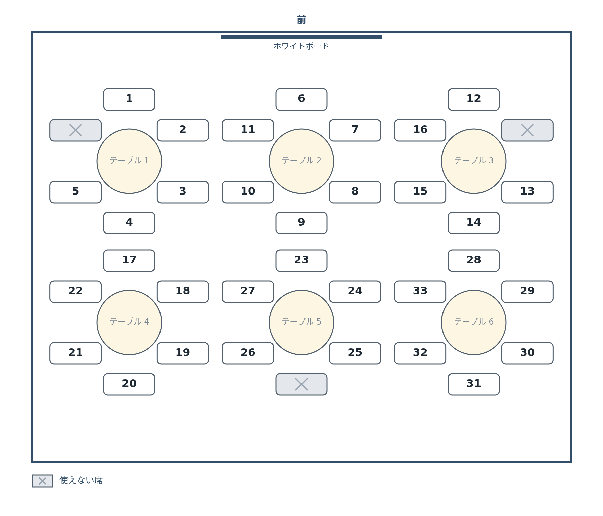

# 席に番号を振る


使える席に**番号**を振ります。これで「17 番の席」と 1 語で指せるようになります。

## 番号の振り方を決める

番号は、振り方のルールを先に決めておくのが大事です。ここでは次のルールにします。

- **テーブル 1 から順に**、テーブルの中は**前側の椅子から時計回り**に 1, 2, 3…
- テーブルが変わっても 1 に戻さず、**通し番号**で続ける
- **使えない席は飛ばす**（番号を付けない）

「1 番はテーブル 1 の前側」と決まっていれば、図を見なくても大体の場所が分かります。

## Codex に頼む

```text
さっきの座席表で、使える席に番号を振ってください。

・テーブル 1 から順に、テーブルの中は前側（ホワイトボード側）の椅子から時計回りに 1, 2, 3… と振ってください
・テーブルが変わっても 1 に戻さず、続けて数えてください
・使えない席は飛ばして、番号を付けないでください
・番号は椅子の真ん中に、大きめの文字で書いてください
・番号は決め打ちで書かずに、描くたびに上のルールで数えるようにしてください
```

最後の 1 行が大事です。**「決め打ちで書かずに、描くたびに数える」**。
これを言っておかないと、Codex が 1〜33 を 1 つずつ椅子に書き込むことがあります。
そうすると、使えない席を変えたときに番号がずれたままになります。

## 動かして確かめる

### できあがりの見本

「PNG で保存」で保存した画像が、次のようになれば OK です。
色や線の太さ・文字の大きさは違っていて構いません。下の確認ポイントを満たしているかで判断してください。



### 確認ポイント

- テーブル 1 の前側の椅子が 1 番で、そこから時計回りに番号が続いている
- テーブル 1 は左前が使えない席なので 1〜5 番、テーブル 2 の前側の椅子が 6 番になっている
- 灰色の椅子には番号が付いていない
- 番号の最後が 33 番（テーブル 6 の左前）になっている

## 言葉で変えてみる


ルールで番号を振っているので、条件を変えても**番号は自動で振り直されます**。確かめてみましょう。

```text
テーブル 2 の、前側の椅子も使えないことにしてください。
```

テーブル 2 の前側が灰色になり、そこから後ろの番号が 1 つずつ詰まって、最後が 32 番になれば成功です。
確かめたら元に戻します。

```text
テーブル 2 の前側の椅子は、使えることに戻してください。
```

番号の振り方そのものを変えることもできます。

```text
テーブルの中の番号を、反時計回りに振るように変えてください。
```

## うまくいかないときの言い方

| 起きたこと | 言い方 |
|---|---|
| 使えない席にも番号がある | 「灰色の椅子にも番号が付いています。使えない席は飛ばして数えてください」 |
| テーブルごとに 1 から数えている | 「テーブルごとに番号が 1 に戻っています。テーブルをまたいで、通し番号で続けて数えてください」 |
| 使えない席を変えても番号がずれない | 「使えない席を変えても番号がそのままです。番号を決め打ちせず、描くたびに数え直してください」 |

## うまくいかないときは

完成例のファイル一式をダウンロードできます。解凍して `index.html` をダブルクリックすると、
見本と同じ画像を保存できるページが開きます。

:::download
[完成例をダウンロード](./project.zip)
:::

## 次へ

次は [席に名前を入れる](../04-names/LECTURE.md) です。いよいよ人が座ります。
