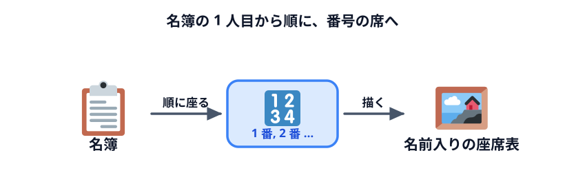
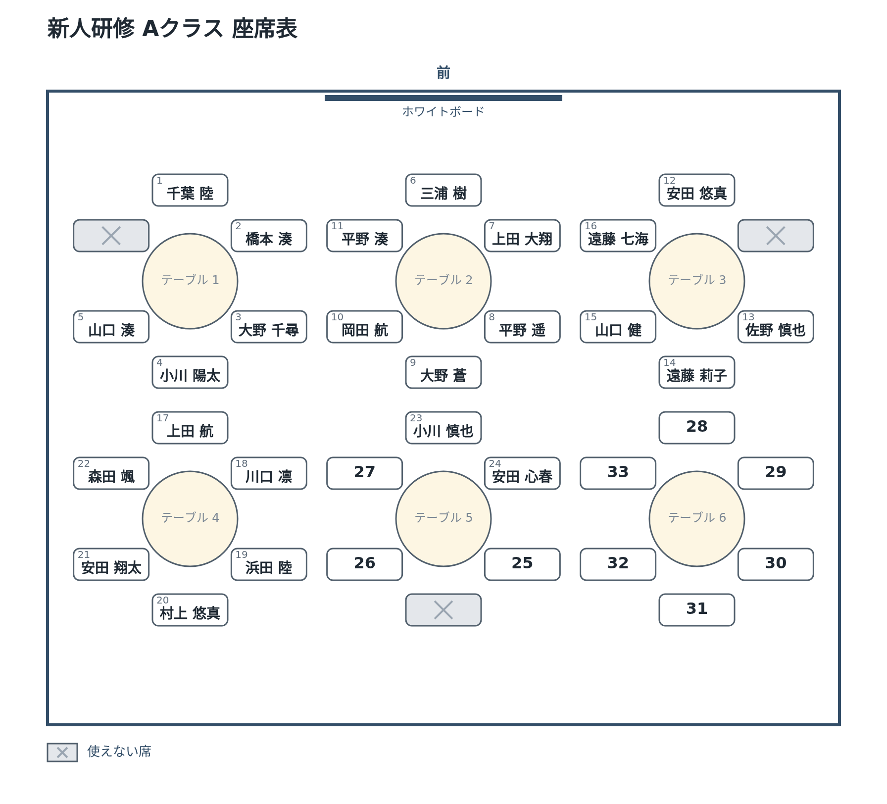
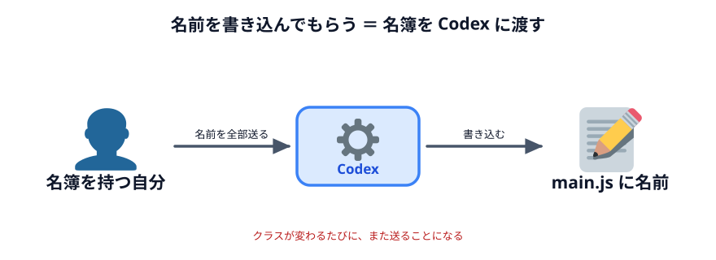

# 席に名前を入れる



番号を振った席に、**人の名前**を入れます。これで、配れる座席表になります。

## 座らせ方を決める

ここでは一番素直なやり方にします。

- 名簿の **1 人目を 1 番の席、2 人目を 2 番の席**…と、番号の順に座らせる
- 人より席が多ければ、残りは**空席**（番号だけ）

「この人は前の方に」のような細かい希望は、あとで言葉で足せます。まずは順番どおりに座らせます。

## Codex に頼む

名前はすべて架空です。

:::prompt{project="座席表"}
```text
さっきの座席表の席に、人の名前を入れてください。

・次の名簿の 1 人目を 1 番の席、2 人目を 2 番の席…と、番号の順に座らせてください
・名前の入った席は、番号を左上に小さく、名前を真ん中に大きく書いてください
・長い名前は、椅子の札からはみ出さないように文字を小さくしてください
・人より席が多いときは、残りの席は番号だけの空席にしてください
・図のいちばん上に「新人研修 Aクラス 座席表」という見出しを入れてください
・保存するファイル名も「新人研修 Aクラス 座席表.png」にしてください
・名簿と見出しは main.js の先頭にまとめてください

名簿（上から順に）:
千葉 陸、橋本 湊、大野 千尋、小川 陽太、山口 湊、三浦 樹、
上田 大翔、平野 遥、大野 蒼、岡田 航、平野 湊、安田 悠真、
佐野 慎也、遠藤 莉子、山口 健、遠藤 七海、上田 航、川口 凛、
浜田 陸、村上 悠真、安田 翔太、森田 颯、小川 慎也、安田 心春
```
:::

## 動かして確かめる

### できあがりの見本

「PNG で保存」で保存した画像（`新人研修 Aクラス 座席表.png`）が、次のようになれば OK です。
色や線の太さ・文字の大きさは違っていて構いません。下の確認ポイントを満たしているかで判断してください。



### 確認ポイント

- 見出しに「新人研修 Aクラス 座席表」と出ている
- 1 番の席が「千葉 陸」、24 番の席が「安田 心春」になっている
- 25〜33 番は名前がなく、番号だけの空席になっている
- 名前が椅子の札からはみ出していない
- 保存したファイルの名前が「新人研修 Aクラス 座席表.png」になっている

## 言葉で変えてみる

:::prompt{project="座席表"}
```text
村上 悠真さんを、名簿のいちばん最初に移してください。
```
:::

村上さんが 1 番の席に来て、ほかの人が 1 つずつ後ろにずれれば成功です。

## この作り方の困ったところ



画像としては、もう十分に使えます。でも、実際の仕事で使うことを考えると困ったことが 2 つあります。

### 1. クラスが変わるたびに、Codex に頼み直す

B クラス、C クラスの座席表も作りたくなったら、そのたびに名簿を貼って Codex に頼むことになります。
クラスが 10 あれば 10 回です。名前を 1 人差し替えるだけでも、Codex に頼みます。

### 2. 名簿を丸ごと Codex に渡している

さっき Codex に送った文面を見返してください。**24 人分の名前がそのまま入っています。**
今回は架空の名前なので問題ありません。でも実際の研修なら、それは本物の社員の名前です。

この「何を Codex に渡しているか」は、次のセクション [セキュリティの話](../../03-security/README.md) で
じっくり扱います。

次の節では、この 2 つを一度に片付けます。**名簿はコードに書かず、ファイルとして手元で読み込む**ようにします。

## うまくいかないときの言い方

| 起きたこと | 言い方 |
|---|---|
| 名前が札からはみ出す | 「長い名前が椅子の札からはみ出しています。札の幅に収まるまで、文字を小さくしてください」 |
| 使えない席に名前が入った | 「灰色の椅子に名前が入っています。名前は番号の付いた席にだけ、番号の順に入れてください」 |
| 見出しが保存した画像に入らない | 「見出しが画面にしか出ていません。保存する画像の中に描いてください」 |

## うまくいかないときは

完成例のファイル一式をダウンロードできます。解凍して `index.html` をダブルクリックすると、
見本と同じ画像を保存できるページが開きます。

:::download
[完成例をダウンロード](./project.zip)
:::

## 次へ

次は [名簿の CSV からまとめて作る](../05-csv/LECTURE.md) です。このセクションの仕上げです。
