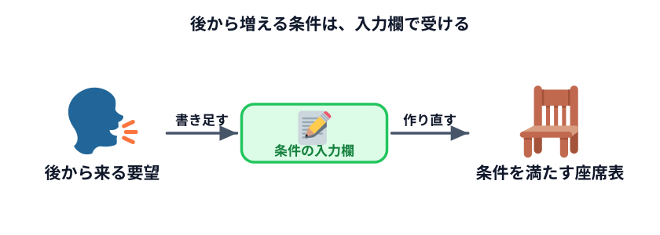
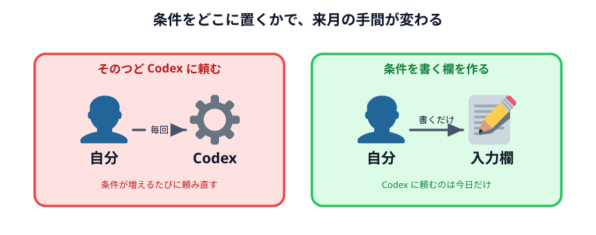

# 条件を伝えながら座席表を修正する



座席表セクションの最後です。ここで、いちばん現実的で、いちばん面倒な要求に対応します。

> 「あの 2 人は隣にしないでください」
>
> 「山本さんと小林さんは同じ案件だから隣がいいです」
>
> 「加藤さんは耳が遠いので前の方に」

**これらは全部、座席表を作り終えたあとに言われます。**

## 後出しの条件をどう受けるか

やり方は 2 つあります。

**A. 言われるたびに Codex に頼んで直してもらう**

```text
高橋さんと伊藤さんを離してください
```

これでも直ります。でも次に「山本さんと小林さんを隣に」と言われたら、また頼む。
来月また人が変わったら、また全部頼み直し。**条件がコードの中に埋まってしまうからです。**

**B. 条件を書く欄を作って、そこに書けば効くようにする**

一度作ってしまえば、来月は欄を書き換えるだけです。Codex に頼むのは今日だけ。



**B を選びます。** これが「データからデータを作る」ではなく「仕組みを作る」ということで、
次のセクション [データと仕組み](../../04-data-and-logic/README.md) の中身そのものです。

## Codex に頼む

```text
さっきの座席表に、席の希望や条件を書ける欄を増やしてください。

・「席の希望・条件」を書くテキスト入力欄を増やしてください
・書き方は1行に1件で、次の4種類にしてください
  「離す A B」      … この2人を隣同士にしない
  「となり A B」    … この2人を隣同士にする
  「前の方 A」      … この人を前half（上の方の行）に
  「後ろの方 A」    … この人を後half（下の方の行）に
・通路をはさんだ席は「隣」ではないものとして扱ってください
・条件をできるだけ満たす席順を探してください。全部は満たせないこともあるので、
  違反の少ない配置を選ぶやり方でかまいません
・座席表の下に、どの条件を満たせてどの条件を満たせなかったかを1行ずつ出してください
・条件に書かれた人が今日欠席の場合は、その条件は対象外として表示してください
```

## いちばん大事なのは最後から 2 つめ

> 座席表の下に、どの条件を満たせてどの条件を満たせなかったかを 1 行ずつ出してください

これを入れないと、**できた座席表が正しいのかどうか分かりません。**

条件を 5 つ書いて、座席表が出てきた。それは 5 つ全部を満たしているのか、3 つだけなのか。
画面を見ただけでは分かりません。目視で確かめるのは、席が増えるほど無理になります。

:::warning[AI に作らせたものを確かめるときの原則]
**結果が正しいかどうかを、自分の目で全部確認しようとしないでください。**
確認できる仕組みを一緒に作ってもらう方が、速くて確実です。

これは座席表に限りません。Codex に何かを作らせるときは、
「その結果が正しいことをどう確かめるか」もセットで頼んでください。
:::

## 動かして確かめる

### 確認ポイント

- 条件の欄に書いた内容が、座席表の下に「満たした / 満たせなかった」として一覧で出る
- 「離す」に書いた 2 人が、実際に隣り合っていない
- 「となり」に書いた 2 人が、実際に隣り合っている
- 条件を書き換えてボタンを押すと、配置が変わる

### わざと矛盾させてみる

同じ 2 人について、条件を両方書いてみてください。

```text
離す 高橋 伊藤
となり 高橋 伊藤
```

**どうなりましたか。** 片方は必ず「満たせなかった」になるはずです。

これが正しい振る舞いです。矛盾した条件を渡されたとき、アプリが黙って片方を無視したり、
エラーで止まったりするのではなく、**何ができて何ができなかったかを言う。**
人間に判断を返しているわけです。

### 押すたびに結果が変わる

ボタンを何度か押すと、条件を満たしたまま配置が変わることに気づくと思います。

これは不具合ではありません。完成例は「席順を何通りか試して、条件を破る数がいちばん少ない
ものを選ぶ」という素朴な方法をとっているためです。**条件を満たす配置は 1 つとは限らない**ので、
毎回違う答えが出ます。

:::notice[「毎回同じにならない」との付き合い方]
これは AI そのものの性質とも重なります。Codex も、同じことを頼んでも毎回同じコードは書きません。

だから**「前と同じ結果か」で確かめるのをやめて、「条件を満たしているか」で確かめる**。
この切り替えが、AI を仕事で使うときのいちばん実用的なコツです。
:::

## 動かして確認する

条件を書き換えて、下の一覧がどう変わるか見てください。矛盾する条件も試してみてください。

::preview[条件を書き換えて「座席表を作る」を押すと、配置と条件の成否が変わります]

::codeview{defaultFile="main.js"}

## ここまでで分かったこと

座席表を 4 段階で作ってきました。振り返ると、やっていたのはこれです。

1. **形を作る**（配置）
2. **例外を入れる**（固定席・使用しない席）
3. **今日の状況を入れる**（出席）
4. **要望を入れて、満たせたかを表示する**（条件）

そして最後に残ったのは、**座席表そのものではなく座席表を作る仕組み**でした。
来月も再来月も、欄を書き換えれば使えます。

:::questions
- Codex に同じ指示を出せば、毎回まったく同じコードが返ってくる [x]
- 条件が後から増えることが分かっているなら、条件を入力欄で受け取る形にしておくとよい [o]
- AI が作ったものが正しいかは、自分の目で全部確認するのが唯一の方法だ [x]
- 矛盾した条件を渡されたとき、何を満たせなかったか表示するのは親切な振る舞いである [o]
:::

## 次へ

ここまで、Codex に**架空のデータ**を渡してきました。
では実際の職場のデータなら渡してよいのでしょうか。

次のセクション [セキュリティの話](../../03-security/README.md) で、その線引きを考えます。
