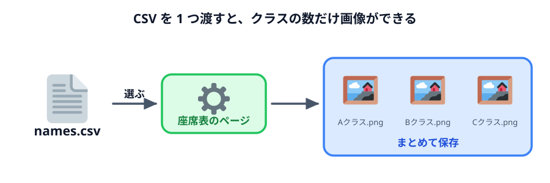
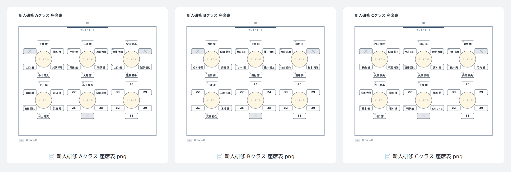
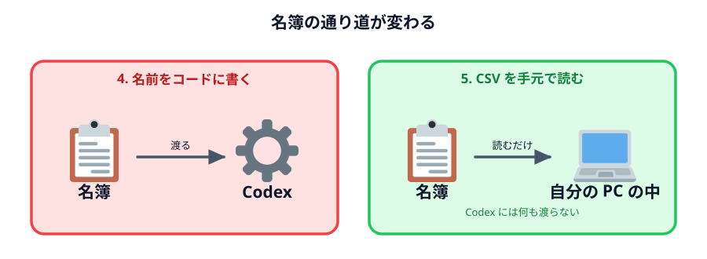

# 名簿の CSV からまとめて作る



このセクションの仕上げです。**名簿の CSV ファイルを選ぶと、クラスごとの座席表がまとめてでき、
一気に PNG で保存できる**ようにします。

## CSV とは

CSV は、表を「カンマ区切りの文字」で保存したファイルです。Excel で「名前を付けて保存」→
「CSV」を選ぶと作れます。今回はこんな形の CSV を使います。

```text
クラス,名前
Aクラス,千葉 陸
Aクラス,橋本 湊
Bクラス,木村 結衣
Cクラス,吉田 花音
```

1 行目は見出し。2 行目からは「クラス」と「名前」の 2 列です。Excel で開くと、ふつうの表に見えます。

練習用の CSV（`names.csv`）は、架空の 70 人・3 クラス分のダミーデータです。ここからダウンロードして、
作業フォルダに置いてください。ページ末尾の完成例の ZIP にも入っています。

:::download
[names.csv（ダミーの名簿・70 人）をダウンロード](./example/names.csv)
:::

自分で Excel で作っても構いません。

## Codex に頼む

入力欄に `names.csv` を添付してから（入力欄の ＋ から選ぶか、ファイルを入力欄にドラッグします）、
次の文を送ってください。

:::prompt{project="座席表" attachments='[{"name":"names.csv","type":"csv"}]'}
```text
さっきの座席表を、名簿の CSV ファイルからまとめて作れるように変えてください。
CSV の形は、添付した names.csv を見てください。中身は練習用のダミーデータです。

・画面に CSV ファイルを選ぶボタンを置いてください
・CSV は 1 行目が「クラス,名前」の見出しで、2 行目からクラスと名前が並んでいます
・クラスごとに 1 枚ずつ座席表を作って、画面に並べて表示してください
・見出しは「新人研修 Aクラス 座席表」のように、クラスの名前を入れてください
・座らせ方は今までと同じで、そのクラスの 1 人目を 1 番の席から順に座らせてください
・「まとめて PNG で保存」ボタンで、全クラスの画像を一度にダウンロードできるようにしてください
・ファイル名は「新人研修 Aクラス 座席表.png」のようにしてください
・席より人が多いクラスがあったら、何人分足りないかを画面に出してください
・Excel でそのまま保存した CSV でも文字化けしないようにしてください
・main.js に書いていた名簿は消してください。CSV を選ぶ前は、短いサンプルを表示しておいてください
・CSV はこのページの中で読むだけにして、どこにも送らないでください
```
:::

今回は練習用のダミーデータなので添付しています。**実際の名簿なら添付しません。**
Codex に必要なのは「CSV がどんな形か」だけで、それは文章でも伝えられます。
実際の名簿は、できあがったページに**自分の PC の中で**読み込ませます。

## 動かして確かめる

ブラウザを再読み込みして、「ファイルを選択」から `names.csv` を選びます。

### できあがりの見本

`names.csv` を選んで「まとめて PNG で保存」を押したとき、次の 3 枚の画像が保存されれば OK です。
色や線の太さ・文字の大きさは違っていて構いません。下の確認ポイントを満たしているかで判断してください。



### 確認ポイント

- A・B・C の 3 クラス分の座席表が並んで表示される
- それぞれの見出しにクラスの名前が入っている
- 「まとめて PNG で保存」を押すと、3 つの PNG ファイルがダウンロードされる
- ダウンロードしたファイルの名前が「新人研修 Aクラス 座席表.png」のようになっている

:::notice[「複数ファイルのダウンロード」を聞かれたら]
Chrome や Edge は、1 つのページから立て続けにファイルを保存しようとすると、
「このサイトで複数のファイルをダウンロードしますか？」と確認してきます。**「許可」**を選んでください。
1 枚しか保存されなかったときは、アドレスバーの右端にブロックの印が出ていないか見てください。
:::

## Excel で作った CSV で試す

自分で名簿を作って試してみましょう（名前は架空のものにしてください）。

1. Excel の 1 行目に `クラス` `名前`、2 行目から適当なクラスと名前を入れる
2. 「名前を付けて保存」で、ファイルの種類を **CSV（コンマ区切り）** にして保存する
3. ページの「ファイルを選択」から、その CSV を選ぶ

文字化けせずに名前が出れば成功です。

## 何が変わったか



前の節と比べてみてください。

| | 4. 名前をコードに書く | 5. CSV を手元で読む |
|---|---|---|
| クラスが増えたら | Codex に頼み直す | CSV に行を足すだけ |
| 名前を 1 人差し替えたら | Codex に頼み直す | CSV を直すだけ |
| Codex に渡す必要がある名簿 | 全員分 | **0 人**（形が伝われば足りる） |
| 10 クラス分の画像 | 10 回頼んで 10 回保存 | ボタン 1 回 |

Codex に作ってもらったのは**名簿を読んで座席表を描く仕組み**で、名簿そのものは要りません。
この「データではなく仕組みをもらう」考え方は、後半の [データと仕組み](../../04-data-and-logic/README.md) と
[シフト表を作る](../../05-shift-table/README.md) でもう一度出てきます。

## 完成例

:::download
[完成例をダウンロード](./project.zip)
:::

## このセクションのまとめ

- 部屋の大きさも、テーブルの並べ方も、使えない席も、**言葉で伝えればプログラムになる**
- 変えたいときも**言葉で頼めばいい**。ルールで作っておけば、番号のような後の処理は自動でついてくる
- 名簿のように毎回変わるものは、**コードに書かずにファイルで渡す**。仕事が楽になり、
  Codex に渡るデータも減る

次のセクション [セキュリティの話](../../03-security/README.md) では、この「Codex に何を渡すか」を
正面から考えます。
