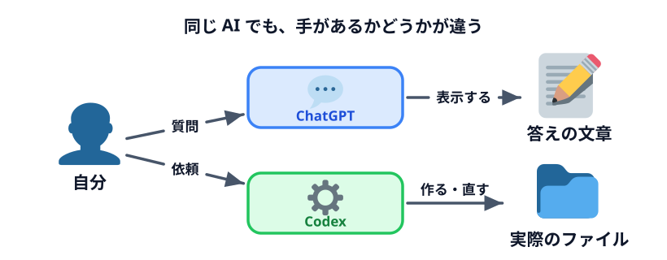
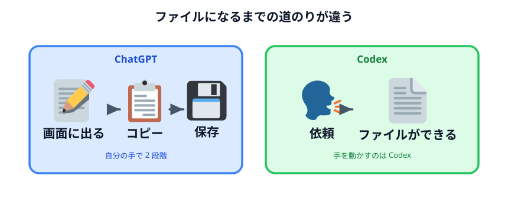
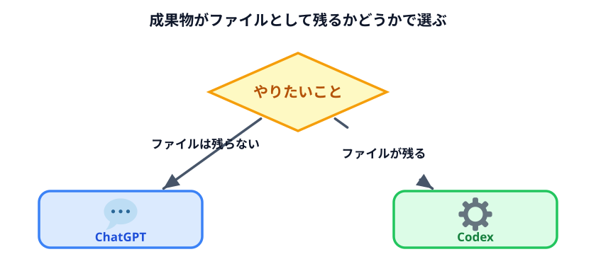

# AI エージェントってなに？

座席表を作ってみて、ChatGPT を使っているときとは何かが違う、と感じたと思います。
その違いをはっきりさせます。

## ChatGPT と Codex の違いは「手があるかどうか」

どちらも中身は同じ種類の AI です。違うのは**できることの範囲**です。

| | ChatGPT | Codex |
|---|---|---|
| 返ってくるもの | **文章** | **実際のファイル** |
| 行き先 | 画面に表示される | 指定したフォルダに保存される |
| できること | 考える・書く・答える | 考える・書く・答える ＋ **作る・直す・実行する** |
| たとえるなら | 相談できる人 | 相談できて、**手も動かしてくれる**人 |

ChatGPT に「座席表の HTML を書いて」と頼むと、**コードが画面に表示されます。**
それを自分でコピーして、メモ帳に貼って、`index.html` という名前で保存する必要があります。

Codex に同じことを頼むと、**フォルダの中に `index.html` ができています。** コピーも保存も要りません。

この「手がある」ことを指して **AI エージェント**と呼びます。

## エージェントにできること

Codex がフォルダに対してできるのは、ファイルを作ることだけではありません。

- ファイルを**作る**
- ファイルを**読む**
- ファイルを**書き換える**
- ファイルを**消す**
- プログラムを**実行する**

座席表のときは「作る」しか使っていませんが、**残りもできます。**
これがこのセクションで扱う話の出発点です。

:::notice[怖がる必要はありません]
できるからといって、勝手にやるわけではありません。何かをする前に「これをしていいですか」と
聞いてきます。その仕組みは [AI エージェントに与える権限](../04-permissions/LECTURE.md) で扱います。
:::

## Codex の得意なこと

**手を動かす量が多い作業**です。

- 決まった形のファイルをたくさん作る
- フォルダの中のファイルをまとめて直す
- 自分では書けないプログラムを、動く形まで持っていく
- 作ったものを実際に動かして、動かなければ直す

最後の「動かして、直す」が大きい。ChatGPT だと、返ってきたコードが動かなかったとき、
エラーメッセージをコピーして貼り直す往復が必要です。Codex は自分で動かして自分で直します。

## ChatGPT の得意なこと

**考えをまとめる作業**です。

- 案を出す、比べる、選ぶ
- 文章を書く、直す、要約する
- 分からないことを教えてもらう
- 「そもそもこれ、どうするのがいいと思う？」と相談する

ファイルにする必要がないものは ChatGPT の方が速いです。Codex だと、
毎回「ファイルを作りましょうか」という方向に話が寄ってしまいます。

## 使い分けの目安

迷ったらこれで判断してください。

> **成果物がファイルとして残るなら Codex。残らないなら ChatGPT。**

- メールの文面を考える → ChatGPT
- 議事録を要約する → ChatGPT
- 座席表を作る画面がほしい → **Codex**
- 100 個のファイルの名前を一括で直したい → **Codex**
- 「この業務、自動化できると思う？」と相談する → ChatGPT

## 今日この後の話につながること

Codex には手がある。だから便利で、だから気をつけることがあります。

- **手がある = 渡したフォルダの中身を読める。** 何を置いたフォルダを渡すかが問題になります
  → [外に出してはいけないデータ](../02-data-to-protect/LECTURE.md)
- **手がある = 書き換えも削除もできる。** どこまで任せるかを決める必要があります
  → [AI エージェントに与える権限](../04-permissions/LECTURE.md)

:::questions
- ChatGPT と Codex では、中身の AI がまったく別のものである [x]
- Codex は、指定したフォルダの中にファイルを直接作ることができる [o]
- Codex にできるのはファイルを作ることだけで、書き換えや削除はできない [x]
- メールの文面を考えるだけなら、Codex より ChatGPT の方が向いている [o]
:::

## 次へ

次は [外に出してはいけないデータ](../02-data-to-protect/LECTURE.md) です。
