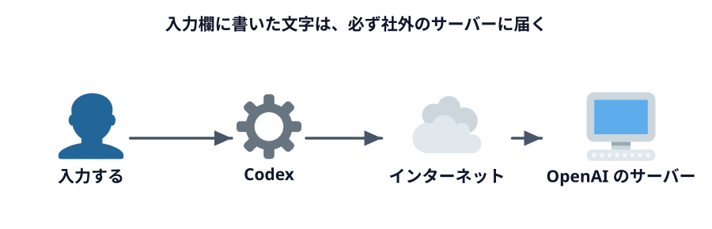
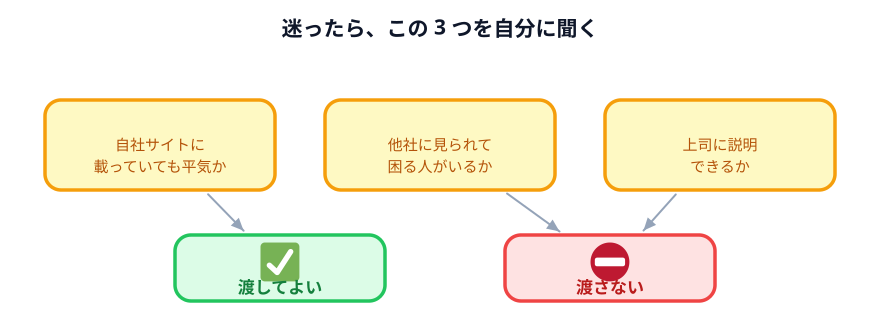

# 外に出してはいけないデータ

まず、はっきりさせておくべき事実が 1 つあります。

:::warning[Codex に書いた文字は、必ず社外に出ます]
Codex は自分の PC の中で考えているわけではありません。入力した文字は**インターネットを通って
OpenAI のサーバーに送られ、そこで処理されます。**

これは設定で変えられません。「学習に使わせない設定」はありますが、それは
**送らなくなる設定ではありません。** その違いは次の
[学習されない設定](../03-training-optout/LECTURE.md) で扱います。
:::

つまり、**Codex の入力欄に貼ったものは、社外のサーバーに渡したのと同じ**です。
その前提で、何を貼ってよいかを考えます。

## 渡してはいけないものの分類

### 個人情報

生きている個人を特定できる情報です。

- 氏名、住所、電話番号、メールアドレス
- 生年月日、マイナンバー、口座番号
- 顔写真、社員番号と氏名の組み合わせ
- 人事評価、給与、病歴、家族構成

**組み合わせにも注意が必要です。** 「40 代・男性・経理」だけなら個人は特定できませんが、
「40 代・男性・経理・△△支店」まで揃うと、社内の人には誰か分かってしまいます。

### 顧客情報

自社の顧客に関する情報は、**自社のものではなく顧客から預かっているもの**です。

- 顧客の企業名、担当者名、連絡先
- 取引条件、見積金額、契約内容
- 顧客から預かった資料・データ

顧客との契約に守秘義務の条項があるのが普通です。**AI に渡したことが契約違反になる**
可能性があります。「便利だったから」は説明になりません。

### 社内の商品・サービスに関する情報

外に出ていない部分が問題になります。

- 原価、仕入れ値、利益率
- 製造方法、レシピ、設計図
- 仕入れ先、取引先の一覧
- 販売実績の内訳

**公開されている情報は問題ありません。** 自社サイトに載っている商品説明を貼るのは自由です。
問題になるのは「サイトに載せていない部分」です。

### 未公開の情報

時間が経てば公開されるが、**今はまだ出ていない**もの。

- 発表前の新商品、新サービス
- 決算発表前の業績数値
- 人事異動、組織変更
- M&A、提携の話

上場企業では、これらの一部は**インサイダー情報**にあたります。
扱いを間違えると法律の問題になります。

## 判断に迷ったときの 3 つの問い

分類を覚えるより、この 3 つを自分に聞く方が速いです。

1. **これが自社のウェブサイトに載っていても平気か？**
   → 平気なら渡してよい。まずければ渡さない
2. **これが他社に見られたら、誰かが困るか？**
   → 困る人がいるなら渡さない（その誰かは顧客かもしれないし、同僚かもしれない）
3. **これを渡したことを、上司に説明できるか？**
   → 説明できないなら渡さない

3 つめが一番実用的です。「効率化のために使いました」で通らない相手には、
最初から渡さない方がいい。

## では、どうするのか

ここで「じゃあ何もできないじゃないか」と思ったかもしれません。**そんなことはありません。**

このハンズオンの後半は、まるごとその答えです。

| やり方 | どこで扱うか |
|---|---|
| データを記号に置き換えて渡す | [データを隠して使う](../../05-shift-table/02-masked-data/LECTURE.md) |
| データを渡さず、仕組みだけ作ってもらう | [仕組みからデータを作る](../../04-data-and-logic/02-logic-to-data/LECTURE.md) |
| 作った仕組みを自分の PC だけで動かす | [データを渡さない仕組みを作る](../../05-shift-table/03-local-logic/LECTURE.md) |

**渡さずに済む方法がある**、というのがこのハンズオンの結論です。
そしてそのやり方は、渡すやり方より手間が増えるどころか、**繰り返し使える分だけ得**です。

## 自社のルールを確認する

ここまでは一般論です。**最終的には自分の組織のルールが優先します。**

確認しておくとよいこと。

- 生成 AI の業務利用について、社内規程やガイドラインがあるか
- 使ってよいサービスが指定されているか（会社契約の ChatGPT Business など）
- 申請や届出が必要か
- 禁止されているデータの種類が明文化されているか

:::notice
ルールが無い会社も多いです。その場合は「無いから自由」ではなく、
**「無いから、まだ誰も考えていない」**と捉えてください。あなたが最初の事例になります。
:::

:::questions
- Codex に入力した文字は、設定次第で自分の PC の外に出ないようにできる [x]
- 自社サイトに公開済みの商品説明を Codex に貼るのは、一般に問題ない [o]
- 顧客の情報は自社のものなので、自社の判断だけで AI に渡してよい [x]
- 「40 代・男性・経理・△△支店」のような組み合わせでも、個人が特定されることがある [o]
- 社内に生成 AI のルールが無いなら、何を入力しても問題ない [x]
:::

## 次へ

次は [学習されない設定](../03-training-optout/LECTURE.md) です。
「学習させない設定にしたから大丈夫」がどこまで本当なのかを見ます。
