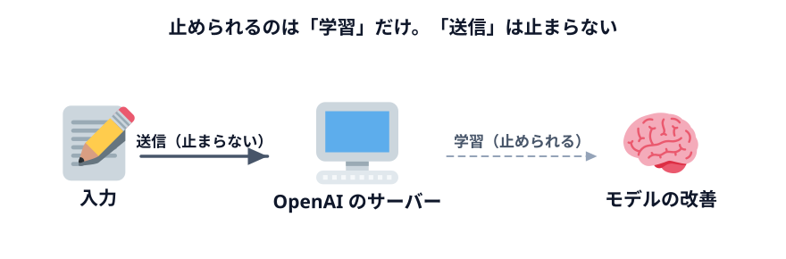
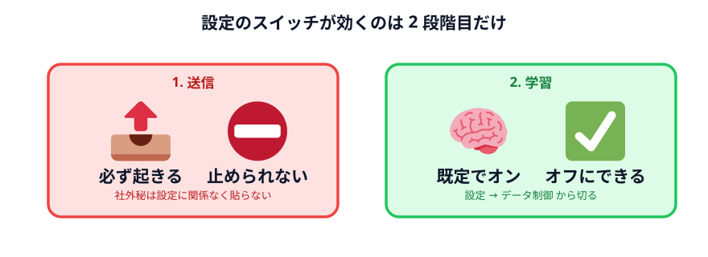
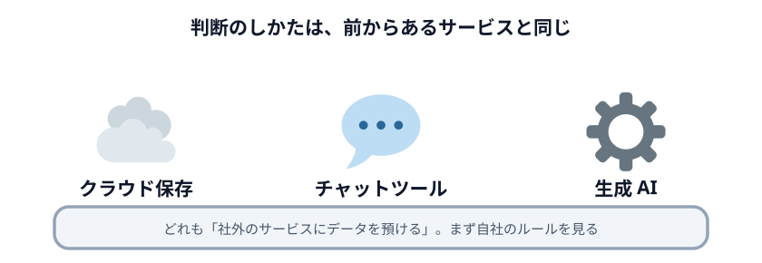

# 学習されない設定

「学習させない設定にしたから大丈夫」という言い方をよく聞きます。
**半分正しくて、半分は誤解です。** そこを整理します。

## まず、2 つは別の話

入力した文字には、**2 つの段階**があります。

| | 何が起きるか | 設定で止められるか |
|---|---|---|
| **1. 送信** | 入力が OpenAI のサーバーに届く | **止められない** |
| **2. 学習** | 届いた内容が次のモデルの改善に使われる | **止められる** |

学習をオフにしても、**1 の送信は起きています。**

たとえるなら、手紙を出すのをやめたわけではなく、
「受け取った人が、この手紙を資料室に保管しないでください」と頼んだ状態です。
手紙は届いています。読まれてもいます。保管されないだけです。

:::warning[ここが一番の誤解ポイント]
「学習されない設定にしたので、社外秘を貼っても大丈夫ですよね？」

**違います。** 学習されなくても、データは社外のサーバーに送られています。
社外に出してはいけないデータは、設定に関係なく貼ってはいけません。
:::

## それでも設定する意味はある

とはいえ、学習をオフにする意味はちゃんとあります。

- 入力した内容が、**将来のモデルの一部にならない**
- 他人が同じような質問をしたときに、こちらの内容が反映される可能性が消える
- 「学習に使わせない設定はしています」と社内に説明できる

**やっておくべきです。** ただし「これで何でも貼れる」にはなりません。

## 設定のしかた

### 個人プラン（Free / Plus / Pro）

個人のプランは、**既定では学習に使われます。** 自分でオフにする必要があります。

1. ChatGPT を開く
2. 右上のアカウントアイコン → **設定**
3. **データ制御**（Data controls）
4. **「Improve the model for everyone」**（モデルの改善に協力する）を**オフ**

この設定は Codex にも効きます。ChatGPT 側でオフにすれば、Codex での作業も学習に使われません。

:::notice[Codex には別の設定もあります]
Codex には「Include environments」という別の設定があり、作業環境の情報を学習に使うかを
決めています。**ChatGPT 側の設定を変えても、こちらは変わりません。**
気になる場合は Codex の設定画面も確認してください。
:::

### 会社のプラン（Business / Enterprise / Edu）

会社で契約しているプランは、**既定で学習に使われません。** 自分で何かする必要はありません。

ただし管理者が「協力する」設定に変えることは可能です。会社のアカウントを使っていて
気になる場合は、情報システム部門に確認してください。

## 設定できても、確認は自分でやる

設定画面のスイッチ名や場所は変わります。**今日の手順が半年後も同じとは限りません。**

だから、次の 2 つを習慣にしてください。

1. **新しい AI サービスを使い始めるとき、データの扱いの設定を最初に見る**
2. **「学習されない」と書いてあっても、「送られない」とは書いていないことを確認する**

## クラウドサービスと同じように考える

実は、この話は生成 AI に特有ではありません。

会社のファイルを Google ドライブに置くとき、何を確認しますか。
Slack に顧客情報を貼るとき、どう判断しますか。
**それと同じ判断を、Codex に対してもすればいい**だけです。

| | 社外にデータが行く | 会社の承認が要ることが多い | ログが残る |
|---|---|---|---|
| クラウドストレージ | ○ | ○ | ○ |
| チャットツール | ○ | ○ | ○ |
| **生成 AI** | **○** | **○** | **○** |

新しいものだと思うと判断に迷いますが、**「社外のサービスにデータを預ける」という意味では
前からあるものと同じ**です。会社にクラウドサービスの利用ルールがあるなら、
まずそれを見てください。

:::questions
- 学習をオフにすれば、入力内容は OpenAI のサーバーに送られなくなる [x]
- 個人の ChatGPT プランは、既定では入力内容が学習に使われる [o]
- ChatGPT 側で学習をオフにすると、Codex での作業にもその設定が効く [o]
- 会社の Business / Enterprise プランは、既定で学習に使われない [o]
- 学習をオフにしたなら、社外秘のデータを貼っても構わない [x]
:::
