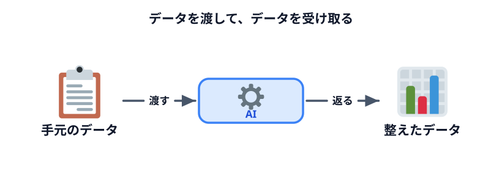
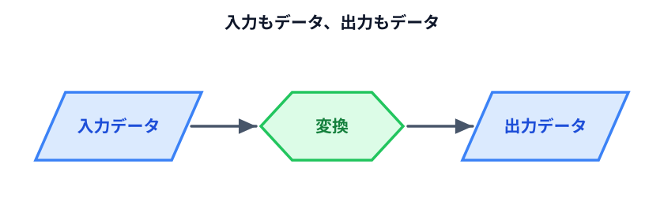
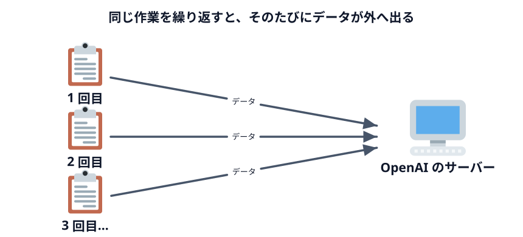

# データからデータを作る

まず、いま多くの人が自然にやっている使い方から整理します。

## いちばんよくある使い方

手元にデータがある。形を変えたい。AI に渡して、変えてもらう。

- もらった名簿がばらばらなので、表の形にそろえたい
- 長い議事録を、要点 5 つにまとめたい
- 英語のメールを、日本語にしたい
- アンケートの自由記述を、内容ごとに分類したい

これが **「データからデータを作る」** です。**入力もデータ、出力もデータ。**
AI はその間の変換をします。

下のデモは、その形を絵にしたものです。左に貼ったばらばらの名簿が、右で表になります。

::preview[左のテキストを書き換えると、右の表がすぐに変わります]{demo="transform" height="360"}

## この使い方の良いところ

**速い。** そして**準備が要りません。**

貼って、頼んで、受け取る。3 ステップで終わります。プログラムを作る必要も、
仕組みを考える必要もありません。

**1 回しかやらない作業なら、これがいちばん効率的です。** わざわざ仕組みを作るのは
時間の無駄になります。

## この使い方の限界

限界は 2 つあります。

### 1. 毎回やらないといけない

来月また同じ名簿が来たら、また貼って、また頼みます。**作業は減っていません。**
手でやるより速いだけです。

10 回やれば 10 回分の時間がかかります。100 回なら 100 回分。

### 2. 毎回データが外に出る

これが今日の本題です。

貼るたびに、その内容が OpenAI のサーバーに送られます。名簿を 10 回貼れば、
**10 回とも送っています。**

[外に出してはいけないデータ](../../03-security/02-data-to-protect/LECTURE.md) で見たとおり、
渡してはいけない種類のデータがあります。この使い方だと、**そのデータそのものを渡さないと
仕事が進みません。**

## だから別の形が要る

整理するとこうなります。

| | データからデータを作る |
|---|---|
| 速さ | **速い**（準備なし） |
| 繰り返し | 毎回やり直し |
| データの行き先 | **毎回、社外に出る** |
| 向いている場面 | **1 回きりの作業** |

**向き不向きの問題であって、良し悪しではありません。** 1 回きりの作業なら、
これ以上のやり方はありません。

問題は、繰り返す作業とデータの出せない作業です。そこで次の形が要ります。
