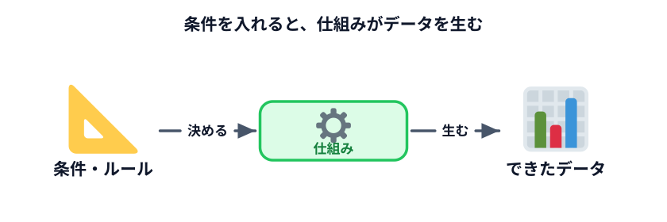
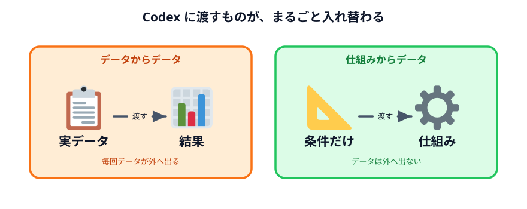
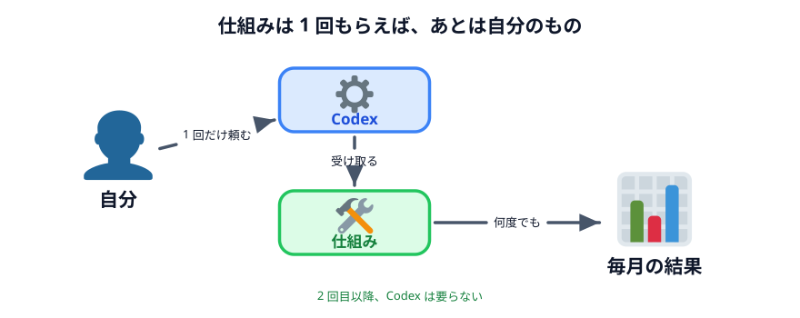

# 仕組みからデータを作る



前の節では、入力も出力もデータでした。ここで**入力を変えます。**

> データを渡すのをやめて、**条件を渡す。**

## 条件だけ渡すと何が起きるか

具体的に見た方が速いです。下のデモを触ってください。

左にあるのは条件だけです。**人の名前も、勤務希望も、何も入っていません。**
それでも右に当番表ができます。

::preview[つまみを動かすと、右の当番表が変わります]{demo="rule" height="420"}

「4 人で 10 日分、1 日 2 人」という条件から、当番表というデータが生まれました。
**データを渡していないのに、データができています。**

これが **「仕組みからデータを作る」** です。



## 仕組みとは何か

大げさな言葉に聞こえますが、中身は単純です。

> **条件やルールを、そのとおりに動く形にしたもの。**

さっきのデモの中で動いているのは、こういう手順です。

1. 名簿の先頭から順番に選ぶ
2. 最後まで行ったら先頭に戻る
3. 決めた日数分くり返す

これだけです。**これを人間の言葉のまま書くと「手順書」、コンピュータが読める形にすると
「プログラム」**と呼ばれます。中身は同じものです。

Codex に頼むのは、この「コンピュータが読める形にする」部分です。
**手順を考えるのは自分**で、**それを形にするのが Codex**。役割が分かれています。

## 何が変わるのか



| | データからデータ | 仕組みからデータ |
|---|---|---|
| Codex に渡すもの | **データそのもの** | **条件の説明だけ** |
| 1 回目の手間 | 少ない | **多い**（仕組みを作る） |
| 2 回目以降の手間 | 1 回目と同じ | **ほぼゼロ** |
| データの行き先 | 毎回、社外に出る | **1 回も出ない** |

大事なのは下 2 行です。

**2 回目以降がほぼゼロ。** 仕組みは残るので、来月も再来月も使えます。

**データが 1 回も出ない。** 条件の説明（「4 人で 10 日分、1 日 2 人」）には、
社外に出してまずい情報が入っていません。実際のデータは、できあがった仕組みに
自分の PC の中で流し込みます。

## いつ仕組みにするか

全部を仕組みにする必要はありません。**目安はこれです。**

| 条件 | 判断 |
|---|---|
| 1 回きり／データも出せる | データを渡す。それが速い |
| 何度も繰り返す | **仕組みにする** |
| データが社外に出せない | **仕組みにする**（選択肢がない） |
| 手順が毎回変わる | データを渡す（仕組みにしても使い回せない） |

3 つめが重要です。**データが出せないなら、仕組みにするしか道がありません。**
逆に言えば、仕組みにすれば扱えるようになる、ということでもあります。

:::notice[「仕組みを作る」は難しくありません]
プログラムを書くのは Codex です。自分がやるのは、**手順を言葉で説明すること**だけ。

「先頭から順番に選んで、最後まで行ったら先頭に戻って、10 日分くり返す」
——これが説明できれば、仕組みは作れます。座席表でもう体験しました。
:::

## 頼み方が変わる

同じ当番表を作るのでも、頼み方が変わります。

**データを渡す頼み方**

```text
次のメンバーで10日分の当番表を作ってください。
田中、佐藤、渡辺、高橋
1日2人ずつでお願いします。
```

**仕組みを頼む頼み方**

```text
当番表を作るページを作ってください。

・人数、日数、1日あたりの人数を画面で指定できるようにしてください
・メンバーの名前は画面で入力できるようにしてください
・名簿の先頭から順番に割り当てて、最後まで行ったら先頭に戻ってください
・全員の回数がなるべく同じになるようにしてください
・ブラウザだけで動くようにして、通信はしないでください
```

後者には**人の名前が 1 つも出てきません。** それでも同じ当番表が作れます。

:::questions
- 「仕組みからデータを作る」では、Codex に実際のデータを渡す必要がない [o]
- 仕組みを作るには、自分でプログラムを書けるようにならないといけない [x]
- 1 回しかやらない作業でも、必ず仕組みにした方がよい [x]
- 社外に出せないデータを扱う作業は、仕組みにすれば進められることがある [o]
:::
