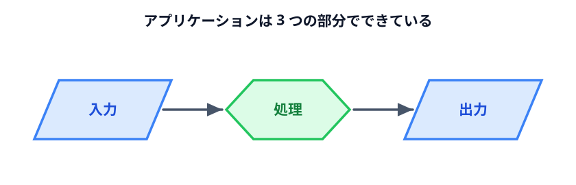
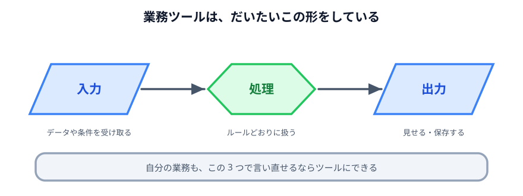

# 仕組みを Web アプリケーションにする



仕組みができたとして、それを毎回どうやって動かすのか。

ファイルをダブルクリックしたら画面が出て、データを入れてボタンを押せば結果が出る。
**それが Web アプリケーションです。**

## アプリケーションは 3 つの部分でできている

難しそうな言葉ですが、中身は 3 つだけです。

| | 何をするところか | 座席表でいうと |
|---|---|---|
| **入力** | データや条件を受け取る | マップ・席の情報・出席・条件の欄 |
| **処理** | 受け取ったものをルールどおりに扱う | 条件を満たす席順を探す部分 |
| **出力** | 結果を見せる・保存する | 画面に並ぶ座席表 |



座席表もシフト表も、この形をしています。**業務ツールはほぼ全部この形です。**

## 見てみる

下は交通費を集計するアプリです。3 つのパネルが「入力」「処理」「出力」に
そのまま対応しています。

左の明細を書き換えて「集計する」を押してみてください。
真ん中の「処理」に、何をやっているかが順番に出ます。

::preview[明細を書き換えて「集計する」を押すと、処理の内容と結果が変わります]{height="620"}

### 注目してほしいところ

**真ん中のパネル**です。ふつうのアプリでは、処理の中身は見えません。
ボタンを押したら結果が出るだけです。

ここでは、わざと**中で何をやっているかを表示**しています。

1. 明細を 1 行ずつに分ける（10 行）
2. 日付・区間・金額に切り分ける（10 件を読み取り）
3. 日付ごとにまとめる（5 日分）
4. 合計を出す（3,807 円）

**これが「仕組み」の正体です。** 特別なことは何もしていません。
人間が手でやっている手順を、そのまま順番に並べただけです。

:::notice[自分の業務を 3 つに分けてみる]
最後のセクションで自分の題材を選びます。そのとき、この 3 つで言い直せるかを確かめてください。

- **入力は何か？**（何を受け取るのか。Excel？　メール？　手書きのメモ？）
- **処理は何か？**（受け取ったものに何をするのか。集計？　並べ替え？　振り分け？）
- **出力は何か？**（何ができれば終わりか。表？　ファイル？　メールの文面？）

**3 つとも言えるなら、ツールにできます。** 言えないところがあるなら、そこがまだ
自分でも整理できていない部分です。
:::

## 読み取れなかった行を出す

もうひとつ、地味ですが大事な部分があります。

明細の中に、こういう行を足してみてください。

```text
10/25 打ち合わせ交通費（領収書なし）
```

金額が読み取れないので、**「読み取れませんでした」と出ます。** 黙って無視はしません。

これは意図した動きです。**集計から勝手に消えるのがいちばん危ない。**
合計が合わないことに、誰も気づけないからです。

:::warning[ツールを作るときの鉄則]
**処理できなかったものは、必ず見せる。**

エラーで止める必要はありません。止まると他の行も処理できなくなります。
「これは処理できませんでした」と言いながら、残りは処理する。これが正解です。

Codex に頼むときも、この 1 行を足してください。
「読み取れなかった行は、捨てずに画面に出してください」
:::

## 保存も自分の PC の中で終わる

「CSV で保存」を押すと、ファイルがダウンロードされます。

**このとき通信は一切起きていません。** どこかのサーバーに送って、加工してもらって、
返してもらっているわけではありません。ブラウザがその場でファイルを組み立てて、
その場で保存しています。

この点は次の節で詳しく見ます。

## 動かして確認する

::preview[明細を足したり消したりして、処理と出力がどう変わるか確かめてください]{height="620"}

::codeview{defaultFile="main.js"}

## 次へ

次は [Web 技術ってなに？](../04-web-tech/LECTURE.md) です。
なぜブラウザだけでこれだけのことができるのかを見ます。
