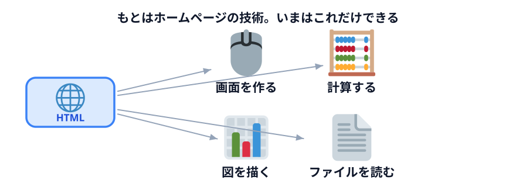
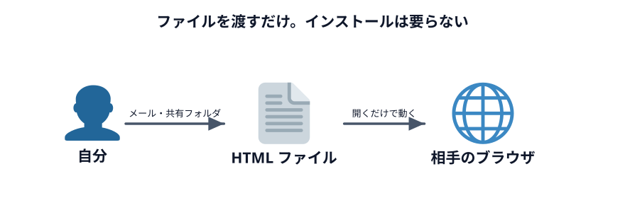

# Web 技術ってなに？

ここまで作ってきたものは、全部 `.html` というファイルでした。
**ホームページを作るためのファイル**です。

なぜホームページの技術で、座席表や集計ができるのか。そこを見ます。

## もともとはホームページを作るための技術

`.html` は 1990 年代に「文章をインターネットで読めるようにする」ために生まれました。
見出しがあって、段落があって、リンクで別のページに飛べる。それだけのものでした。

そこから 30 年かけて、**ブラウザの中でできることがどんどん増えました。**
いまのブラウザは、文章を表示するだけの道具ではありません。

## 何ができるのか

4 つ見てもらいます。どれもインターネットにつながっていません。

### 1. 画面を作る

入力欄、選択肢、チェックボックス、ボタン、表。**これらは最初から部品として用意されています。**
自分で作る必要はありません。

下のデモは HTML だけで書かれていて、プログラムは 1 行も動いていません。それでも
入力欄には文字が打てるし、選択肢は選べます。

::preview[入力欄に文字を打ったり、選択肢を切り替えたりできます]{demo="screen" height="480"}

### 2. 計算する

数字を入れると、その場で計算し直します。Excel の数式に近い感覚です。

::preview[数字を書き換えると、すぐ下の結果が変わります]{demo="calc" height="330"}

### 3. 図を描く

グラフも描けます。**画像を用意しているのではなく、その場で線と四角を描いています。**
だから数字を変えると形が変わります。

::preview[データを書き換えると、グラフが描き直されます]{demo="draw" height="460"}

### 4. ファイルを読み書きする

自分で選んだファイルを読んで、加工して、保存し直せます。

::preview[「サンプルを作る」で CSV を書き出して、それを選んで読み込んでみてください]{demo="file" height="520"}

:::notice[ブラウザは勝手にフォルダを見に行けません]
このデモでは、**人がファイルを選ぶ**ところから始まります。
ブラウザが勝手に PC の中を探すことはできません。

これは制限であり、同時に**安全のための仕組み**です。ホームページを開いただけで
PC の中身を読まれたら困るからです。

フォルダごと扱いたいときに [Python](../../01-setup/02-python/LECTURE.md) の話が出てくるのは、
この制限を超える必要があるからです。
:::

## インストールしなくても配れる

ここが実務でいちばん効きます。

作った `.html` ファイルは、**メールに添付しても、共有フォルダに置いても、
そのまま相手のブラウザで動きます。**

- 相手に何かをインストールしてもらう必要がない
- 管理者権限も、申請も、サーバーも要らない
- Windows でも Mac でも動く

社内で「便利なツールを作ったから使って」と渡すとき、この差は大きいです。
インストールが要るものは、それだけで使われなくなります。

:::warning[ファイルを渡すときの注意]
逆に言うと、**中身のデータごと渡してしまう**ことになります。

サンプルデータを入れたまま配ると、それも一緒に届きます。
配る前に、入力欄の初期値に実データが残っていないか確認してください。
:::

## インターネットに公開しなくていい

もうひとつ。**Web の技術だからといって、インターネットに公開する必要はありません。**

| やり方 | 誰が見られるか |
|---|---|
| インターネットに公開する | **世界中の誰でも** |
| 共有フォルダに置く | 社内の人 |
| **自分の PC に置く（今日のやり方）** | **自分だけ** |

今日作ってきたものは全部、3 つめです。**自分の PC の中だけで動いていて、
どこにも公開されていません。**

「Web アプリを作る」と聞くと、サーバーを借りて公開するイメージがありますが、
そこまでしなくていい場面がほとんどです。

:::questions
- HTML で作ったツールを使ってもらうには、相手にソフトのインストールが必要である [x]
- ブラウザは、人が選んでいないファイルでも自由に読むことができる [x]
- ブラウザの中だけでグラフを描いたり CSV を保存したりできる [o]
- Web の技術で作ったものは、必ずインターネットに公開しなければならない [x]
- 作った HTML ファイルを配るときは、入力欄に実データが残っていないか確認した方がよい [o]
:::

## セクションのまとめ

- **データからデータ** — 速い。1 回きりの作業向き。毎回データが外に出る
- **仕組みからデータ** — 準備が要る。繰り返す作業向き。**データが外に出ない**
- **Web アプリケーション** — 仕組みを「入力・処理・出力」の形で誰でも使えるようにしたもの
- **Web 技術** — インストール不要で配れて、自分の PC だけで動かせる
