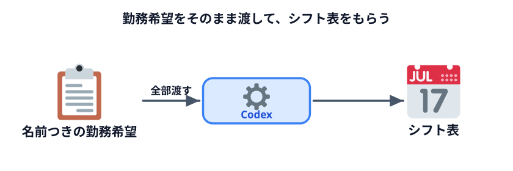
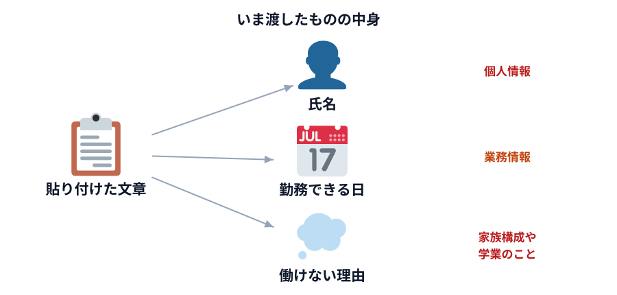

# データをそのまま使う



シフト表を 4 通りのやり方で作ります。まずは**いちばん素直なやり方**から。

データをそのまま Codex に渡して、シフト表を作ってもらいます。

## 使うデータ

架空のスタッフ 6 名の勤務希望です。下をコピーして使ってください。

```text
【スタッフの勤務希望】
田中美咲   月・火・木・金に出られます。土日は保育園の都合で不可。
佐藤健太   火・水・金・土。月曜は大学の講義があります。
渡辺由紀   月・水・木・土・日。週4日まで希望。
高橋大輔   月・火・水・木・金。フルタイム希望。
伊藤さくら 金・土・日のみ。学業優先で週3日まで。
山本翔太   火・木・土・日。連勤は3日までにしてほしい。

【条件】
・1日あたり2人体制
・全員を最低1日は入れる
・特定の人に偏らないようにする
```

## Codex に頼む

Codex（Work モード）の入力欄に、次のようにまとめて貼ってください。

```text
次のスタッフの勤務希望と条件から、1週間（月〜日）のシフト表を作ってください。
表の形で出してください。各人の勤務日数も出してください。

（ここに上のデータを貼る）
```

## 出てきたものを見る

数秒でシフト表が返ってきたはずです。

### 確認ポイント

- 月〜日の全部の曜日に、2 人ずつ入っている
- 誰も、出られない曜日に入っていない
- 各人の勤務日数が出ている
- 「週 4 日まで」「週 3 日まで」が守られている

**たぶん、かなり良い出来だと思います。** 人間が手でやるより速いし、条件もそこそこ守られています。

## このやり方の良いところ

**準備がゼロです。**

プログラムも要らない。アプリも要らない。貼って頼むだけ。
今日ここまでで学んだことを何も使わずに、いきなり結果が出ています。

**1 回きりなら、これがベストです。** 迷う必要はありません。

## では、何が問題か

2 つあります。

### 1. 来週も再来週も、同じことをする

来週のシフトを作るとき、また貼って、また頼みます。

**作業時間は減りません。** 1 回 5 分なら、1 年で 52 回 × 5 分 = 4 時間ちょっと。
手作業よりは速いですが、ゼロにはなりません。

### 2. 渡したものを思い出してください

いま貼ったのは何でしたか。

- **人の名前**（6 名分）
- **その人がいつ働けるか**
- **なぜ働けないか**（保育園、大学の講義、学業優先）



3 つめが重いです。「保育園の都合」は**家族構成**の情報です。
「大学の講義」は**学生であること**。これらは、本人が職場に共有したつもりのもので、
**社外に出すつもりで話したものではありません。**

今回は架空のデータなので何も起きません。でも**明日これを実データでやったら、
それは個人情報を社外に送ったことになります。**

:::warning[ここで止まらないでください]
「じゃあ使えないじゃないか」で終わると、今日の収穫はゼロです。

**使えます。** 渡すものを変えればいい。それを次の 2 つの節でやります。
:::

## 考えてみてください

次に進む前に、少しだけ考えてください。

> **上のデータのうち、シフトを組むために本当に必要なのはどれですか？**

「田中美咲」という名前は、シフトを組む計算に必要でしょうか。
「保育園の都合で」という理由は、計算に影響するでしょうか。

答えは次の節にあります。
