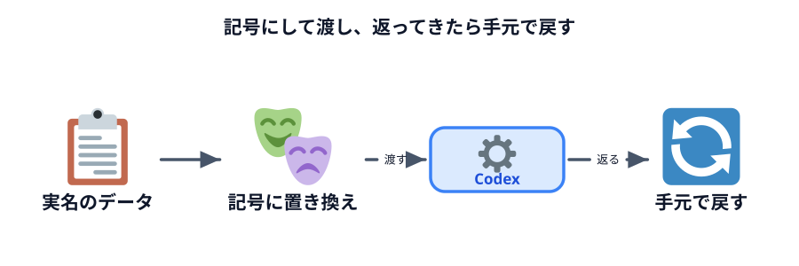
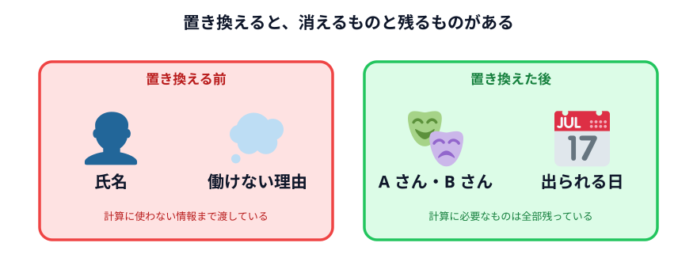
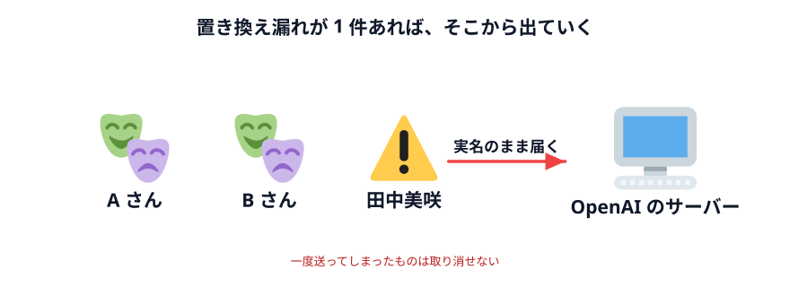

# データを隠して使う



前の節の最後の問いです。

> シフトを組むために、本当に必要なのはどの情報か。

## 答え合わせ

シフトを組む計算に必要なのは、これだけです。

| 情報 | 必要か | 理由 |
|---|---|---|
| 誰が | **必要**（ただし区別できればいい） | 同じ人を 2 回入れないため |
| いつ出られるか | **必要** | これが計算の中身 |
| 何日まで | **必要** | 上限の判定に使う |
| **名前が「田中美咲」であること** | **不要** | A さんでも計算は同じ |
| **保育園の都合であること** | **不要** | 出られないという結果だけで足りる |

**名前と理由は、計算に 1 ミリも影響していません。** 区別さえつけばいいので、
記号で足ります。

## 置き換えて渡す

同じデータを、こう書き換えます。

```text
【スタッフの勤務可能日】
Aさん  月・火・木・金
Bさん  火・水・金・土
Cさん  月・水・木・土・日（週4日まで）
Dさん  月・火・水・木・金
Eさん  金・土・日（週3日まで）
Fさん  火・木・土・日（連勤3日まで）

【条件】
・1日あたり2人体制
・全員を最低1日は入れる
・特定の人に偏らないようにする
```

比べてみてください。



**消えたもの**

- 6 人分の氏名
- 保育園に子どもを預けている人がいるという事実
- 大学に通っている人がいるという事実
- 学業を優先している人がいるという事実

**残ったもの**

- 6 人を区別できること
- それぞれ、いつ出られるか
- 上限の条件

**計算に必要なものは全部残っています。**

## Codex に頼む

置き換えたデータで、前と同じように頼んでください。

```text
次のスタッフの勤務可能日と条件から、1週間（月〜日）のシフト表を作ってください。
表の形で出してください。各人の勤務日数も出してください。

（ここに置き換えたデータを貼る）
```

### 確認ポイント

- **前の節と同じくらいの品質のシフト表が出てきた**

これが一番大事な確認です。**情報を減らしたのに、結果は変わりません。**
AI は名前を知らなくても、まったく同じ計算ができます。

## 戻す

出てきた結果は「A さん、B さん」のままなので、手元で実名に戻します。

```text
Aさん = 田中美咲
Bさん = 佐藤健太
Cさん = 渡辺由紀
Dさん = 高橋大輔
Eさん = 伊藤さくら
Fさん = 山本翔太
```

**この対応表は、自分の手元にだけ置きます。** Codex には渡しません。
Excel なり手元のメモなりに書いておいて、返ってきたシフト表を置換します。

:::notice[置換は Excel でも Codex でもできます]
対応表を使った置換自体は単純作業なので、これも自動化できます。
ただし**その自動化に対応表を使う**ので、Codex ではなく手元でやってください。
Excel の置換機能で十分です。
:::

## このやり方の限界

置き換えは強力ですが、万能ではありません。**3 つの穴があります。**

### 1. 小さい組織だと特定できる

「6 人の職場で、金土日しか出られない週 3 日の人」——これが誰か、
**社内の人なら分かります。**

記号にしても、条件の組み合わせが特徴的なら個人は絞り込めます。
これを**再識別**といいます。

### 2. 毎回、置き換えの作業が必要

来週も、その次の週も、置き換えて、渡して、戻す。**手間が増えています。**

前の節は「貼るだけ」でした。こちらは「置き換えて、貼って、戻す」の 3 工程です。

### 3. 置き換え漏れが起きる

これが一番こわい。急いでいるとき、1 人分だけ実名が残っていても気づきません。
そして**一度送ってしまったものは取り消せません。**



## それでも使う場面はある

限界はありますが、**実務でいちばん使うのはこのやり方**です。

- 1 回きりだが、データは出せない
- 仕組みを作るほどではない
- でも生データは渡したくない

このときの現実解が置き換えです。**完璧ではないが、何もしないよりずっといい。**

:::questions
- シフトを組む計算には、スタッフの実名が必要である [x]
- 記号に置き換えれば、どんな場合でも個人が特定される心配はなくなる [x]
- 「A さん = 田中さん」の対応表も Codex に渡しておくと、結果が実名で返るので便利である [x]
- 情報を減らしても、シフト表の品質はほとんど変わらない [o]
:::

## 次へ

次は [データを渡さない仕組みを作る](../03-local-logic/LECTURE.md) です。
置き換えすら要らないやり方に進みます。
