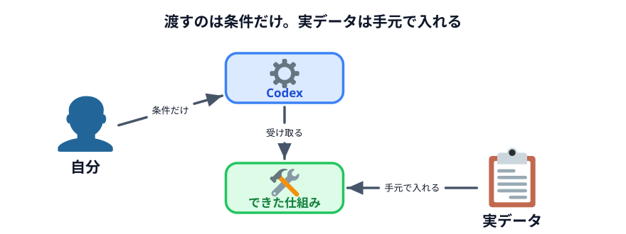
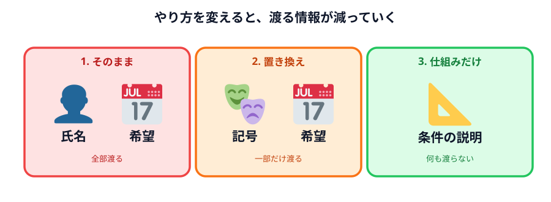
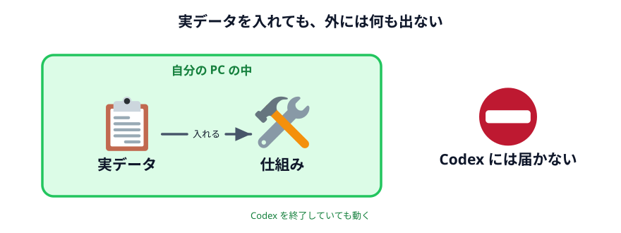

# データを渡さない仕組みを作る



3 つめのやり方です。ここが今日の本命です。

> **Codex には、シフトを組むプログラムだけを作ってもらう。**
> **実際のデータは、自分の PC の中で入れる。**

## 何を渡すのか

前の 2 つと比べてみます。

| | 渡すもの |
|---|---|
| 1. そのまま | 名前・勤務希望・理由・条件 |
| 2. 置き換え | 記号・勤務可能日・条件 |
| **3. 仕組みだけ** | **どういう画面と、どういう計算がほしいかの説明** |

3 つめには、**スタッフの情報が 1 文字も入りません。** 記号すら渡しません。

渡すのは「こういうツールがほしい」という説明だけです。



## Codex に頼む

作業フォルダを指定した状態で、次を貼ってください。

```text
シフト表を組むためのページを作ってください。

・index.html をダブルクリックすればそのまま動くようにしてください
・インターネットへの通信は一切しないでください。外部のファイルも読み込まないでください
・入力は2つ。どちらもテキスト入力欄にしてください
  1つめ「勤務できる曜日」… 1行1人で「名前 出られる曜日を空白区切り」
  2つめ「条件」… 1行1件で「1日の人数 2」「最大勤務日数 4」「連勤上限 3」の3種類
・「シフトを組む」ボタンを押すと、月〜日の1週間のシフト表を作ってください
・勤務日数が少ない人から優先して割り当てて、偏らないようにしてください
・出られない曜日には絶対に入れないでください
・条件を満たせたかどうかを、1行ずつ画面に出してください
・人数が足りない日があれば、その日を目立たせてください
・結果をCSVで保存できるボタンを付けてください
・最初はサンプルのデータが入っていて、開いた時点で結果が見えるようにしてください

私はプログラミングが分からないので、ファイルは index.html と main.js と style.css の
3つだけにしてください。
```

## この頼み方のポイント

長いですが、ひとつずつ見ると全部意味があります。

| 書いた行 | なぜ書くのか |
|---|---|
| 通信しないでください | **これが今日の目的。**書かないと外部のライブラリを読むことがある |
| 入力はテキスト入力欄で | 貼り付けで済む。ファイルを選ぶ手間が要らない |
| 勤務日数が少ない人から | **計算のルール。**ここを書かないと偏る |
| 出られない曜日には絶対に | 絶対に破ってはいけない条件を明示する |
| 条件を満たせたかを出して | [座席表](../../02-seating-chart/05-csv/LECTURE.md) の「席が足りない」表示と同じ。確認できる形にする |
| 人数が足りない日を目立たせて | 黙って足りないまま出されるのが一番こわい |
| CSV で保存できるボタン | 使ったあとどうするかまで含めて設計する |

:::notice[ここに書いてあるのは全部「条件」です]
もう一度確認してください。**この文章に、スタッフの名前は 1 つも出てきません。**
勤務希望も入っていません。

それでも、シフトを組めるツールができます。
:::

## 動かして確かめる

できた `index.html` をダブルクリックして開きます。

### 確認ポイント

- サンプルのデータが入っていて、開いた時点でシフト表が見えている
- 「勤務できる曜日」を書き換えてボタンを押すと、シフトが変わる
- 出られない曜日に誰も入っていない
- 条件の確認が 1 行ずつ出ている
- CSV で保存できる

### 条件を厳しくしてみる

条件を書き換えて、わざと無理をさせてください。

```text
1日の人数 3
最大勤務日数 2
```

**人数が足りない日が出るはずです。** そこが赤くなっていれば正解です。

エラーで止まるのではなく、「ここが足りません」と教えてくれる。
これが [仕組みを Web アプリケーションにする](../../04-data-and-logic/03-web-app/LECTURE.md)
で見た形です。

## 実データを入れてみる

ここからが本番です。**自分の職場の実際のデータを入れてみてください。**

（このハンズオンでは架空のデータのままで構いません。でも、
帰ってから実データでやることを想定して読んでください）

実名を入れます。実際の勤務希望を入れます。**そして何も起きません。**

- Codex は開いていなくていい
- インターネットにつながっていなくていい
- データはこのページの中だけを行き来している



:::notice[Codex を閉じて試してください]
本当に Codex が要らないことを確かめるには、**Codex アプリを終了してから**
`index.html` を開いてみるのが早いです。

普通に動きます。もう Codex は関係ありません。**仕組みだけもらえば、あとは自分のものです。**
:::

## 3 つのやり方を比べる

| | 1. そのまま | 2. 置き換え | 3. 仕組みだけ |
|---|---|---|---|
| Codex に渡す個人情報 | **全部** | 一部（条件） | **なし** |
| 1 回目の手間 | 小 | 中 | **大** |
| 2 回目以降の手間 | 小 | 中 | **ほぼゼロ** |
| 結果の質 | 良い | 良い | **良い＋条件の確認つき** |
| 来週使えるか | 作り直し | 作り直し | **そのまま使える** |
| Codex が必要か | 毎回必要 | 毎回必要 | **もう不要** |

**3 が一番手間がかかるのは 1 回目だけです。** そして 1 回目を超えれば、
他の 2 つには戻れません。

## 動かして確認する

::preview[条件を書き換えて「シフトを組む」を押してください。無理な条件にすると不足が赤く出ます]{height="700"}

::codeview{defaultFile="main.js"}

## 次へ

「通信していない」と言われても、信じるかどうかは別の話です。
次の [データの行き先を確認する](../04-data-flow/LECTURE.md) で、**自分の目で確かめます。**
