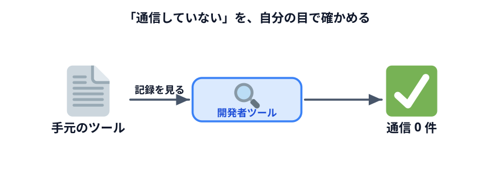
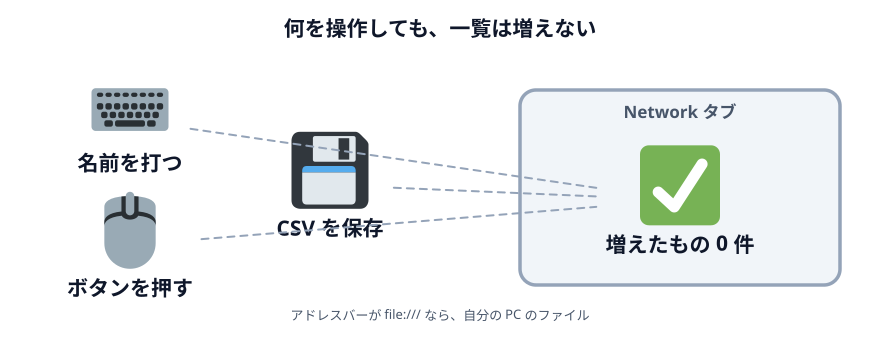
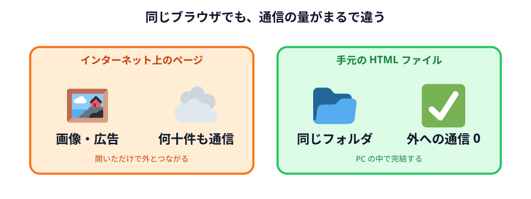
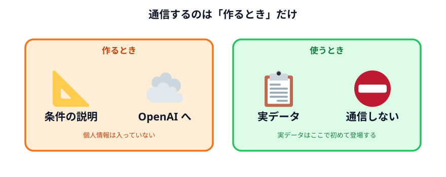

# データの行き先を確認する

前の節で「このツールは通信していません」と書きました。

**信じないでください。** 確かめてください。

これは今日いちばん大事な作業です。**自分で確認できるようになることが、
安心して使えるようになるということ**だからです。

## 開発者ツールを開く

前の節で作った `index.html` を、**ダブルクリックでブラウザに開いてください。**

:::warning[このページのプレビューでは確認できません]
下に埋め込んであるプレビューは、このサイトの一部として表示されています。
サイト自体を読み込む通信があるので、検証には向きません。

**必ず、自分の PC にある `index.html` をダブルクリックして開いたもの**で確認してください。
:::

開いたら `F12` キーを押します。画面の横か下に、見慣れない領域が開きます。
これが**開発者ツール**です。

上の方に並んでいるタブから **Network**（ネットワーク）を選んでください。

:::notice[元に戻したくなったら]
もう一度 `F12` を押せば閉じます。壊れたわけではないので安心してください。
:::

## 記録を取りながら操作する

Network タブを開いたら、**`Ctrl + R`（Mac は `Cmd + R`）でページを再読み込み**します。
ここから記録が始まります。

一覧に、こういうものが並ぶはずです。

| 名前 | 何を読んだか |
|---|---|
| `index.html` | ページ本体 |
| `style.css` | 見た目のファイル |
| `main.js` | 処理のファイル |

**3 つだけです。** そして 3 つとも、同じフォルダの中のファイルです。
外のどこかから取ってきたものは 1 つもありません。

### ここから本番

この状態で、**シフト表の操作をしてください。**

1. スタッフの名前を実名に書き換える
2. 勤務希望を書き換える
3. 「シフトを組む」ボタンを押す
4. 「CSV で保存」を押す

**Network タブに新しい行が増えましたか。**

増えていないはずです。**1 件も。**

名前を打ち込んでも、ボタンを押しても、CSV を保存しても、**どこにも何も送られていません。**

## 比べてみる

「そもそも Network タブが動いているのか」が気になったら、比べてください。

別のタブで、何でもいいのでインターネット上のページ（ニュースサイトなど）を開いて、
同じように Network タブを見てください。

**何十件も並びます。** 画像、広告、追跡用のスクリプト。開いただけでこれだけの通信が起きます。

この差が、**「インターネット上のサービスを使う」と「自分の PC でファイルを開く」の違い**です。

## アドレスバーも見る

もうひとつ、簡単な確認方法があります。アドレスバーです。

| 表示 | 意味 |
|---|---|
| `https://...` | **インターネット上**のページ |
| `file:///C:/Users/...` | **自分の PC の中**のファイル |

`file:///` で始まっていれば、そのページは自分の PC のファイルです。
**どこかのサーバーから配られたものではありません。**

これは開発者ツールを開かなくても分かるので、日常的にはこちらで十分です。

## では、Codex 自体はどうなのか

ここは正確に整理しておきます。混ぜると間違えます。

| 場面 | 通信するか | 何が送られるか |
|---|---|---|
| Codex にツールを作ってもらったとき | **する** | **頼んだ文章**（条件の説明） |
| できたツールを使うとき | **しない** | 何も |

**作るときは通信しています。** あのプロンプトは OpenAI のサーバーに送られました。

でも、**あの文章にはスタッフの情報が入っていません。**
「1 日の人数」「最大勤務日数」といった条件の説明だけです。

そして**使うときは通信しません。** 実データはここで初めて登場して、
この PC から出ません。

これが「データを渡さない仕組みを作る」の全体像です。

## 確認を習慣にする

今日やった確認は、**他のツールにも使えます。**

誰かからもらった `.html` ファイル、ネットで見つけた便利ツール、
自分が昔作ったもの。**Network タブを開いて操作すれば、通信しているかどうかが分かります。**

:::warning[逆に言うと]
通信している `.html` ファイルもあります。見た目では分かりません。

**自分の業務データを入れる前に、一度 Network タブで確認する。**
この習慣だけ持ち帰ってください。数十秒で終わります。
:::

## 参考：完成例のプレビュー

前の節の完成例です（このサイト上で動いているので、検証用ではありません）。

::preview[前の節で作ったシフト表ツールです]{src="05-shift-table/03-local-logic" height="700"}

:::questions
- ブラウザの Network タブを見れば、そのページが通信しているかどうかを確認できる [o]
- アドレスバーが `file:///` で始まっていれば、そのページは自分の PC のファイルである [o]
- Codex に仕組みを作ってもらうときも、通信は一切発生しない [x]
- 手元の HTML ファイルなら、どれも必ず通信しないので確認は不要である [x]
- できあがったツールを使うだけなら、Codex アプリを終了していても動く [o]
:::

## セクションのまとめ

同じ課題を 4 通りで解いて、こうなりました。

1. **そのまま渡す** — 速い。でも全部出ていく
2. **置き換えて渡す** — 手間は増える。出ていく量は減る。漏れのリスクは残る
3. **仕組みだけもらう** — 1 回目は重い。**以降ゼロ。データは出ない**
4. **確かめる** — 自分の目で見る。これができて初めて安心して使える

**3 が正解というより、3 を選べるようになったことが今日の収穫**です。
1 が適切な場面もあります。選べることが大事です。

## 次へ

最後のセクション [自分の業務に応用する](../../06-apply/README.md) です。
自分の仕事から題材を 1 つ選んで、実際に作ってみます。
