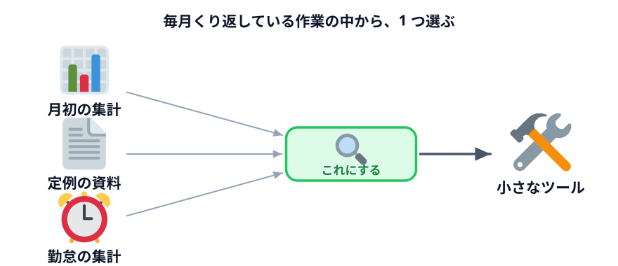
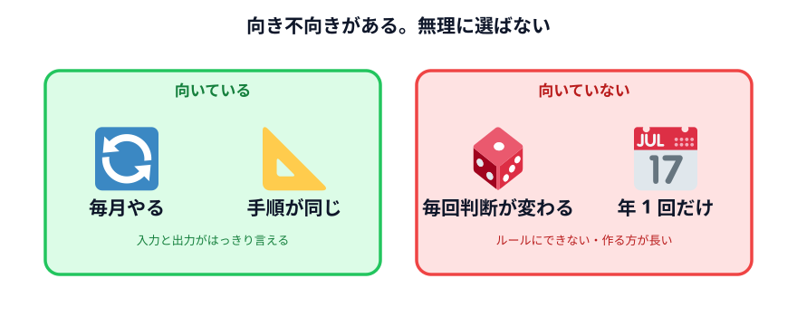
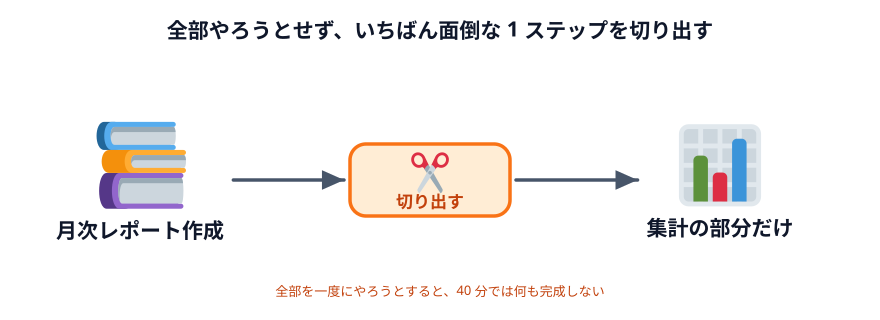

# 自分の仕事の中から「面倒な作業」を探す



ここからは自分の仕事が題材です。まず**題材を見つける**ところから始めます。

10 分で探します。手元に紙かメモアプリを用意してください。

## 探し方

思いつくままに探すと出てきません。**引っかかりやすい問いから入ります。**

### 問い 1：先月、同じ作業を何回やりましたか

月次でやっている作業を書き出してください。

- 月初の集計
- 月末の締め
- 定例会議の資料づくり
- 請求書の確認
- 勤怠の集計

**毎月やっているものは、来月もやります。** ここが一番の狙い目です。

### 問い 2：「またこれか」と思う瞬間はいつですか

感情が動くところに、面倒な作業があります。

- 同じ内容を 2 か所に転記するとき
- Excel を開いて、いつもの並べ替えをするとき
- メールから数字を拾ってまとめるとき
- 「あの表、作り直しておいて」と言われるとき

### 問い 3：新人に説明するとしたら、手順を何ステップで書けますか

**5〜15 ステップくらいで書ける作業**が、ちょうどいい大きさです。

- 3 ステップ以下 → 手でやった方が速い
- 20 ステップ以上 → 大きすぎる。一部を切り出す

## 書き出したら、絞る

いくつか出てきたら、次の表で点をつけてください。

| 見るところ | ○ がつく条件 |
|---|---|
| **繰り返し** | 月 1 回以上やっている |
| **手順の安定** | 毎回だいたい同じ手順でできる |
| **入力と出力** | 「何を受け取って、何を作るか」が言える |
| **判断の少なさ** | 「その時々で考える」部分が少ない |
| **データ** | 社外に出せないデータを扱う（＝仕組みにする価値が高い） |



**○ が 3 つ以上つくものを 1 つ選んでください。** それが今日の題材です。

## 向いていない作業

正直に言うと、向いていないものもあります。無理に選ばないでください。

| 作業 | なぜ向かないか |
|---|---|
| 相手や状況で毎回判断が変わる交渉・調整 | ルールにできない |
| 年に 1 回しかやらない | 作る時間の方が長い |
| 手順が人によって違う | どの手順を仕組みにするか決まらない |
| すでに専用システムがある | そちらを使った方が早い |
| 紙に手書きされたものを扱う | まず入力の部分で詰まる |

:::notice[「向かない」と分かることにも価値があります]
今日の目的は、成果物を持ち帰ることだけではありません。
**「自分の仕事のどこに効いて、どこに効かないか」の感覚**を持ち帰るのも成果です。

全部が自動化できるわけではない、と分かっている人の方が、
実際には AI をうまく使えます。
:::

## 大きすぎたら切る

選んだ題材が大きすぎることがよくあります。そのときは切ります。

**例：月次の売上レポート作成**

これは大きすぎます。中を見ると、こうなっています。

1. 各支店から送られた Excel を集める
2. **1 枚にまとめる**
3. **支店ごと・商品ごとに集計する**
4. 前月との比較を出す
5. グラフを作る
6. コメントを書く
7. PowerPoint に貼る

**太字の 2 つだけ**を今日の題材にします。それだけでも毎月の時間は減ります。



全部を一度にやろうとすると、40 分では何も完成しません。
**一番面倒な 1 ステップだけ**を選んでください。

## 書けたら次へ

決まった題材について、3 行だけメモしてください。

```text
題材：
入力（受け取るもの）：
出力（作るもの）：
```

これが次の節で Codex に相談するときの材料になります。

## 次へ

次は [Codex に相談しながら考える](../02-design-with-codex/LECTURE.md) です。
決めた題材を、Codex と一緒に形にしていきます。
