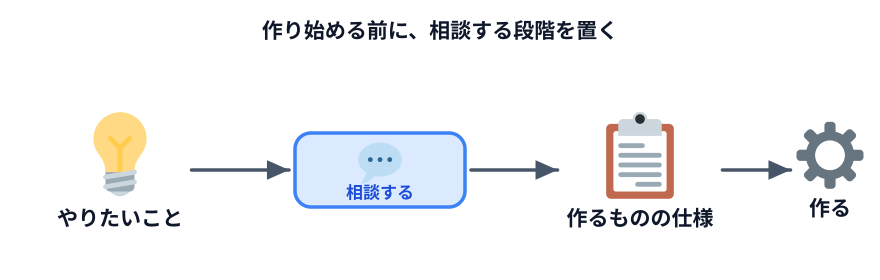
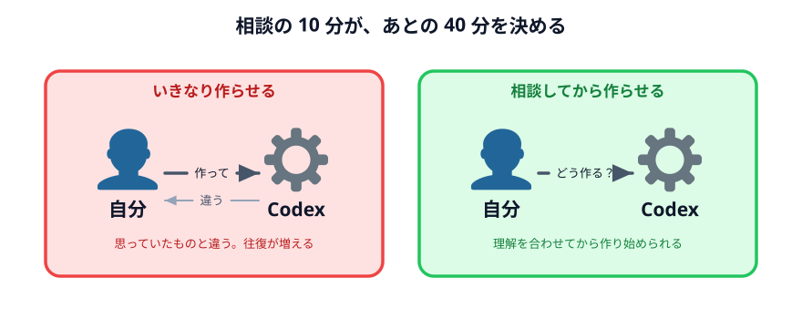

# Codex に相談しながら、どういう仕組みにできるか考える



題材が決まったら、**すぐに作り始めないでください。**

まず相談します。10 分だけです。この 10 分で、あとの 40 分の成功率が変わります。

## なぜ相談から入るのか

いきなり「○○を作って」と頼むと、**Codex は自分の解釈で作ります。** そして
できたものが思っていたのと違う。直す。また違う。この往復で時間が溶けます。

先に「こう作ろうと思うけど、どう？」と相談しておくと、**お互いの理解を合わせてから**
作り始められます。



## 相談は Chat モードで

**ここでは Work モードではなく Chat モードを使ってください。**（切り替えは入力欄の上あたり）

相談の段階でファイルを作られると邪魔になります。話がまとまってから Work に切り替えます。

## 相談用のプロンプト

次の雛形の空欄を埋めて送ってください。

```text
業務を効率化するツールを作りたいので、設計を相談させてください。まだコードは書かないでください。

【いまやっていること】
（　　　　　　　　　　　　　　　　　　）

【入力（毎回受け取るもの）】
（　　　　　　　　　　　　　　　　　　）

【出力（最終的に作りたいもの）】
（　　　　　　　　　　　　　　　　　　）

【条件】
・ブラウザだけで動く1枚のHTMLにしたいです
・インターネットへの通信はさせたくありません
・実際のデータはあなたには渡しません。仕組みだけ作ってもらいます
・私はプログラミングが分かりません

次の3つを教えてください。
1. この作業は、どういう手順に分解できますか
2. 入力の形は、どう決めておくとよいですか
3. この作り方で無理がある部分があれば、先に教えてください
```

:::warning[ここでも情報は出ています]
相談の文章も OpenAI に送られます。**「いまやっていること」の欄に、
顧客名や取引条件を書かないでください。**

「A 社」「取引先」のように書けば相談は成立します。
:::

## 3 つめの質問が大事

最後の「無理がある部分があれば、先に教えてください」を必ず入れてください。

Codex は基本的に「できます」と答えます。頼めば何かは作ります。
**でも、向いていない作り方を選んでいることがあります。**

先に聞いておくと、たとえばこういう答えが返ってきます。

- 「Excel ファイルを直接読むのは、ブラウザだけだと制限があります」
- 「PDF から表を取り出すのは、精度が安定しません」
- 「毎回手順が変わる部分は、ツール化より手作業の方が速いかもしれません」

**作り始める前に聞けてよかった話**です。

## 返ってきたら、確認する

返ってきた手順を読んで、次を確認してください。

- **自分の理解と合っているか**（違うなら、その場で訂正する）
- **入力の形が現実的か**（毎回その形でデータを用意できるか）
- **知らない言葉が出てきていないか**

3 つめは遠慮しないでください。分からない言葉が出てきたら、そのまま聞きます。

```text
「〜」というのが分かりません。プログラミングを知らない人向けに説明してください。
```

**分からないまま進めると、あとで直せなくなります。**

## 手順を確定する

やりとりして納得できたら、最後にこう頼みます。

```text
ありがとうございます。いまの内容をもとに、作ってほしいものの仕様を
箇条書きでまとめてください。私がそれをそのままコピーして、
作成の依頼に使えるようにしてください。
```

**この出力が、次の節でそのまま使えます。**

自分で長い依頼文を書く必要はありません。相談の結果を、Codex 自身にまとめてもらいます。

## 次へ

題材が決まらなかった人、相談してみて向いていないと分かった人は、
[題材カタログ](../03-examples/LECTURE.md) から選んでください。

決まっている人は [小さなツールを作ってみる](../04-build/LECTURE.md) へ進みます。
