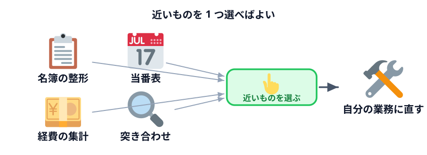

# 題材カタログ



題材が思いつかない人、選んだものが向いていなかった人のための一覧です。

**近いものを 1 つ選んでください。** 全部読む必要はありません。

どれも 40 分で形になる大きさにしてあります。そのまま使ってもいいし、
自分の業務に合わせて変えてもかまいません。

## 1. 名簿・リストの整形

ばらばらの形式で届く一覧を、決まった表の形にそろえる。

- **入力** 手打ちされた名簿（形式がばらばら）
- **処理** 氏名・所属・連絡先に切り分ける／表記ゆれをそろえる
- **出力** 表 ＋ CSV

```text
ばらばらの形式で書かれた名簿を、決まった表の形にそろえるページを作ってください。
・貼り付け欄に名簿を貼ると、氏名・所属・連絡先の3列の表になるようにしてください
・「山田太郎（営業部）内線1234」「山田 太郎  営業部  1234」のようにばらつきがあります
・読み取れなかった行は、捨てずに画面に出してください
・結果をCSVで保存できるようにしてください
・ブラウザだけで動く1枚のHTMLにして、通信はしないでください
```

## 2. 経費・立替の集計

明細を貼ると、分類ごとに合計する。

- **入力** 日付・分類・金額が並んだ明細
- **処理** 分類ごとに合計／多い順に並べる
- **出力** 集計表 ＋ CSV

## 3. 当番表・持ち回りの割り当て

メンバーと期間から、公平に回る当番表を作る。

- **入力** メンバー名、期間、1 回あたりの人数
- **処理** 全員の回数がそろうように順番に割り当てる
- **出力** 当番表 ＋ 各人の回数

```text
当番表を作るページを作ってください。
・メンバーの名前を1行1人で貼り付ける欄を作ってください
・期間（何日分）と、1日あたりの人数を指定できるようにしてください
・全員の回数がなるべく同じになるように割り当ててください
・特定の曜日に入れない人を指定できるようにしてください
・各人の回数を一覧で出してください
・ブラウザだけで動く1枚のHTMLにして、通信はしないでください
```

## 4. 在庫・備品の発注点チェック

在庫数と基準を照らして、発注が必要なものを出す。

- **入力** 品名・現在庫・発注点
- **処理** 発注点を下回ったものを抽出／不足数を計算
- **出力** 発注リスト ＋ CSV

## 5. 日程の候補出し

参加者の都合から、全員が出られる日を探す。

- **入力** 参加者ごとの空いている日
- **処理** 全員が空いている日／多くが空いている日を探す
- **出力** 候補日の一覧（出られる人数つき）

## 6. アンケートの集計

自由記述ではなく、選択式の回答を集計する。

- **入力** 回答が並んだテキスト
- **処理** 選択肢ごとに数える／割合を出す
- **出力** 集計表 ＋ 棒グラフ

```text
アンケートの回答を集計するページを作ってください。
・1行1回答で貼り付ける欄を作ってください
・選択肢ごとの件数と割合を出してください
・棒グラフも描いてください（画像ではなく、その場で描いてください）
・ブラウザだけで動く1枚のHTMLにして、通信はしないでください
```

## 7. チェックリストの自動生成

条件に応じて、必要な項目だけのチェックリストを作る。

- **入力** 案件の種類・規模などの条件
- **処理** 条件に合う項目だけを選ぶ
- **出力** 印刷できるチェックリスト

## 8. 定型文の組み立て

項目を入れると、決まった形式の文面ができる。

- **入力** 宛先・日付・金額などの項目
- **処理** 定型文にはめ込む／条件で文面を切り替える
- **出力** コピーできる文面

:::notice
これは「データからデータを作る」でも済みますが、**毎回同じ形式なら仕組みにした方が速い**です。
入力欄を埋めてボタンを押すだけになります。
:::

## 9. 数字の突き合わせ

2 つの一覧を比べて、合わないところを出す。

- **入力** 一覧 A と一覧 B
- **処理** 片方にしかないもの／金額が違うものを探す
- **出力** 差分の一覧

```text
2つの一覧を突き合わせて、差分を出すページを作ってください。
・貼り付け欄を2つ作ってください（一覧Aと一覧B）
・どちらも「キー 金額」の形式です
・Aにしかないもの、Bにしかないもの、両方にあるが金額が違うものを、
  それぞれ分けて表示してください
・ブラウザだけで動く1枚のHTMLにして、通信はしないでください
```

## 10. 期限の管理表

日付から、残り日数や状態を計算する。

- **入力** 項目名と期限日
- **処理** 今日からの残り日数を計算／期限切れ・間近を判定
- **出力** 色分けされた一覧

## 選んだら

どれを選んでも、次の 2 行は必ず依頼文に入れてください。

```text
・ブラウザだけで動く1枚のHTMLにして、通信はしないでください
・私はプログラミングが分かりません
```

前者が今日の芯です。後者を入れると、説明の粒度が変わります。

## 次へ

[小さなツールを作ってみる](../04-build/LECTURE.md) へ進んでください。
