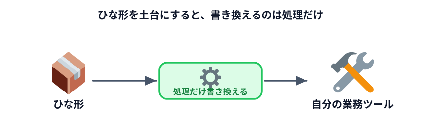
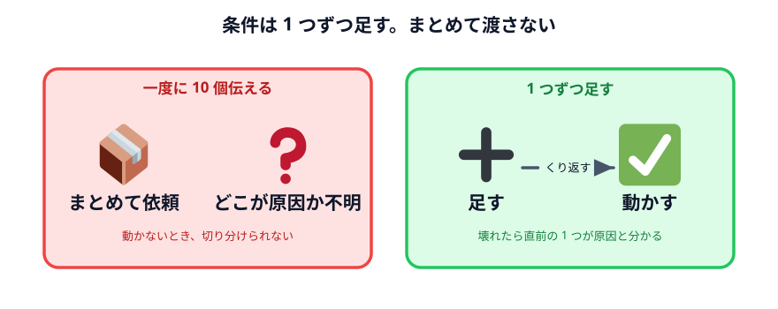

# 実際に小さなツールを作ってみる



40 分あります。作ります。

:::notice[完成させなくていいです]
40 分で業務ツールは完成しません。**完成は今日の目標ではありません。**

「自分の仕事でこれが効くかどうか」が分かれば成功です。
効かないと分かることにも、同じだけの価値があります。
:::

## 2 つの始め方

### A. ゼロから頼む

[前の節](../02-design-with-codex/LECTURE.md)で Codex にまとめてもらった仕様を、
そのまま Work モードに貼ります。

最後に、この 2 行を足してください。

```text
・index.html と main.js と style.css の3つのファイルにしてください
・最初からサンプルのデータが入っていて、開いた時点で結果が見える状態にしてください
```

2 行目が効きます。**空っぽの画面が出てくると、動いているのかどうか分からない**からです。

### B. ひな形から始める（おすすめ）

このページの下にあるひな形をダウンロードして、それを土台にします。

ひな形には「入力 → 処理 → 出力」の骨組みが入っていて、**書き換えるのは処理の部分だけ**に
なるよう作ってあります。

1. ページ下部の「コードをダウンロード」から ZIP を落とす
2. 解凍してできた `app` フォルダを、作業フォルダの中に置く
3. Codex（Work モード）に次のように頼む

```text
app フォルダの中にあるひな形をもとに、（作りたいもの）を作ってください。

main.js の process という関数の中だけを書き換えれば済むように作ってあります。
できるだけそこだけの変更にしてください。

・入力の形式：（　　　　）
・やってほしい処理：（　　　　）
・出力してほしいもの：（　　　　）

通信は一切しないでください。
```

**B の方が速いです。** 形が決まっているので、Codex が迷いません。

## 作りながら気をつけること

### 1 つずつ足す

座席表と同じ進め方です。**全部の条件を最初に伝えないでください。**

1. まず、いちばん単純な形で動かす
2. 動いたら、条件を 1 つ足す
3. また動かす

一度に 10 個の条件を伝えると、どれが原因で動かないのか分からなくなります。



### 動かなかったら、そのまま伝える

エラーの文章が出たら、**それをコピーしてそのまま貼ってください。** 説明し直す必要はありません。

```text
開いたら、画面に次のように出ました。直してください。

（エラーの文章を貼る）
```

何も表示されないときは、`F12` を押して **Console** タブを見てください。
赤い文字が出ていたら、それをコピーして貼ります。

### 実データはまだ入れない

**作っている間は、架空のデータで進めてください。**

Codex はフォルダの中を読みます。作業フォルダに実データを置いてあると、
「参考にしますね」と読まれる可能性があります。

実データを入れるのは、**できあがってからです。**

### 確認できる形にしてもらう

座席表とシフト表で共通していたことを、自分のツールにも入れてください。

```text
・処理できなかった行は、捨てずに画面に出してください
・条件を満たせたかどうかを画面に出してください
```

**この 2 行を足すかどうかで、使えるツールかどうかが決まります。**

## できたら確認する

動いたら、必ずこの 3 つを確認してください。

1. **`F12` → Network タブで、通信が発生していないこと**
   （[データの行き先を確認する](../../05-shift-table/04-data-flow/LECTURE.md) でやった手順）
2. **アドレスバーが `file:///` で始まっていること**
3. **わざと変なデータを入れても、画面が壊れないこと**

3 つめは試してみてください。空っぽの入力、全角の数字、1 行だけ違う形式。
**自分以外の人に渡すつもりなら、ここが効いてきます。**

## 時間が余ったら

- 実データを入れて、結果が正しいか確かめる
- 同僚に渡して使ってもらう（HTML ファイルを送るだけ）
- 条件をもう 1 つ足す

## 時間が足りなかったら

**そのまま持ち帰ってください。** Codex は今日のやりとりを覚えています。
明日続きから頼めます。

作業フォルダごと保存しておけば、家でも会社でも続けられます。

## ひな形

::preview[ひな形です。データを書き換えて「実行する」を押してみてください]{height="680"}

::codeview[ひな形のコード（`process` の中だけを書き換えます）]{defaultFile="main.js"}

## 次へ

残り時間は [質疑応答と持ち帰り](../05-qa/LECTURE.md) です。
