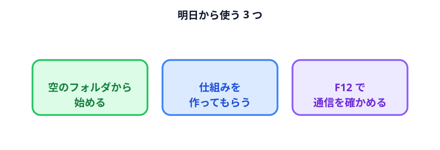

# 質疑応答と持ち帰り

お疲れさまでした。今日のまとめと、よく出る質問への答えです。

## 今日やったこと

| | やったこと | 分かったこと |
|---|---|---|
| 1 | Codex を入れた | フォルダを指定して使う道具だと分かった |
| 2 | 座席表を作った | 言葉で伝えれば作れて、言葉で変えられる。毎回変わるものはファイルで渡す |
| 3 | セキュリティを考えた | **送信は止められない。だから渡さない工夫をする** |
| 4 | データと仕組みを分けた | **答えではなく、答えを作る仕組みをもらう** |
| 5 | シフト表を 4 通りで作った | 情報を減らしても結果は落ちない。むしろ良くなる |
| 6 | 自分の題材で作った | 自分の仕事のどこに効くかが分かった |

## 明日から使う 3 つ

全部は覚えなくていいです。**この 3 つだけ持ち帰ってください。**

### 1. 作業フォルダは、空から作る

Codex に渡すフォルダは、**その作業のために新しく作った空のフォルダ**にする。
デスクトップや既存の業務フォルダを渡さない。

これだけで事故の大半が防げます。

### 2. 「仕組みを作って」と頼む

データを貼る前に、一度考える。

> これ、毎月やってるな。**仕組みにできないか。**

仕組みにすれば、データを渡さずに済みます。そして来月もう一度やらずに済みます。

### 3. `F12` で確認する

もらったツール、作ったツール、拾ってきたツール。
**業務データを入れる前に、Network タブを見る。**

30 秒で終わります。

## よくある質問

### Q. 作ったツールを同僚に渡していいですか

**HTML ファイルを渡すだけで動きます。** インストールは要りません。

ただし 2 つ確認してください。

- 入力欄の初期値に、実データが残っていないか
- 通信していないか（`F12` → Network）

### Q. Excel ファイルを直接読ませられますか

**できますが、今日のやり方より少し難しくなります。**

ブラウザだけで Excel を読むには追加の部品が要ります。CSV に書き出してから貼り付ける方が、
確実で速いです。まずは CSV で始めてください。

### Q. 会社のルールが分からないのですが

情報システム部門か、上司に確認してください。聞き方の例です。

> 「生成 AI を業務で使うにあたって、社内のルールはありますか。
> 特に、どういうデータを入力してよいかの基準を知りたいです」

**ルールが無い場合も多いです。** そのときは、今日の内容を材料にして
「こういう基準で使おうと思います」と提案する側に回れます。

### Q. Codex が作ったコードが正しいか分かりません

**コードを読んで確かめるのは無理です。** 別の方法で確かめます。

- **確認できる仕組みを一緒に作ってもらう**（条件を満たせたかを画面に出す）
- **答えが分かっているデータで試す**（手で計算した結果と合うか）
- **極端なデータを入れてみる**（空っぽ、1 件だけ、大量）

3 つめが効きます。壊れるところが見つかれば、そこを直してもらえます。

### Q. 無料プランでもできますか

画面は開きますが、**途中で上限に当たります。** 今日くらいの分量を通すなら
Plus 以上が要ります。

### Q. 情報漏洩が起きたらどうすればいいですか

**すぐに、隠さずに報告してください。** 送信済みのデータは取り消せませんが、
早く報告すれば打てる手があります（該当アカウントの確認、関係先への連絡など）。

黙っていて後から発覚するのが、いちばん被害が大きくなります。

### Q. AI に仕事を奪われませんか

今日やったことを思い出してください。

**手順を考えたのは自分です。** 条件を決めたのも、何が正しいかを判断したのも、
「この作業は仕組みにする価値があるか」を選んだのも自分です。

Codex がやったのは、**決まった手順を形にすること**だけでした。

## もう一度読むなら

| 迷ったら | 読むところ |
|---|---|
| 何を渡していいか | [外に出してはいけないデータ](../../03-security/02-data-to-protect/LECTURE.md) |
| どこまで任せるか | [AI エージェントに与える権限](../../03-security/04-permissions/LECTURE.md) |
| 仕組みにすべきか | [仕組みからデータを作る](../../04-data-and-logic/02-logic-to-data/LECTURE.md) |
| 通信の確認のしかた | [データの行き先を確認する](../../05-shift-table/04-data-flow/LECTURE.md) |
| 次の題材を探す | [題材カタログ](../03-examples/LECTURE.md) |

この教材はいつでも読めます: <https://seekseep.github.io/ai-adoption-handson/>

## 最後に

今日いちばん伝えたかったのは、これです。

> **「使えない」でも「なんでも使える」でもなく、
> 「こう使えば使える」を自分で判断できるようになること。**

判断の材料は今日そろいました。あとは、明日 1 つ試してみてください。
